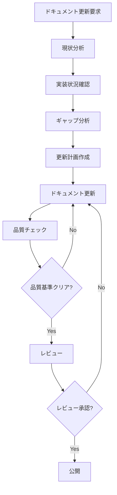
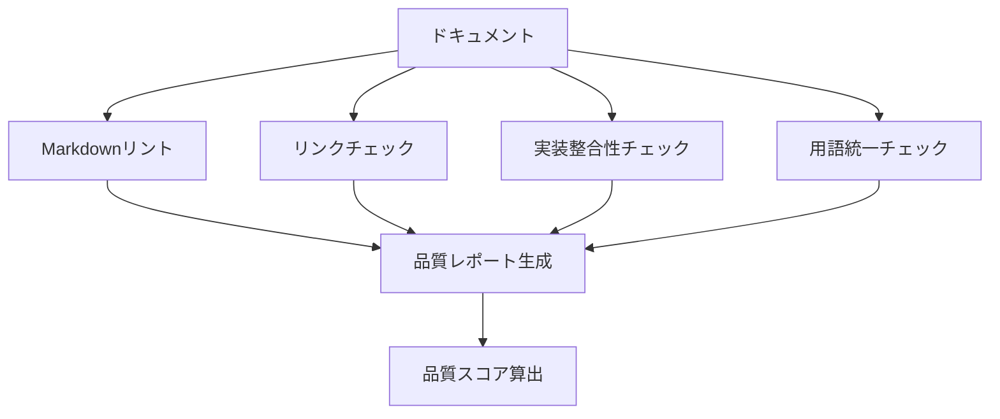

# ドキュメント最新化 - 設計書

## 概要

YOSAKOIパフォーマンス評価システムのドキュメントを現在の実装状況に合わせて最新化し、品質と利便性を向上させるための設計書。

## アーキテクチャ

### ドキュメント構造

```
docs/
├── admin-guide.md          # 管理者ガイド（更新）
├── api-documentation.md    # APIドキュメント（更新）
├── user-manual.md          # ユーザーマニュアル（更新）
├── developer-guide.md      # 開発者ガイド（新規作成）
├── architecture.md         # アーキテクチャドキュメント（新規作成）
├── CHANGELOG.md           # リリースノート（新規作成）
├── images/                # ドキュメント用画像
│   ├── architecture/      # アーキテクチャ図
│   ├── ui-screenshots/    # UI スクリーンショット
│   └── diagrams/          # その他の図表
└── templates/             # ドキュメントテンプレート
    ├── api-endpoint.md    # APIエンドポイント記述テンプレート
    └── troubleshooting.md # トラブルシューティング記述テンプレート
```

### ドキュメント品質基準

#### Markdown品質基準
- MD022: 見出しの前後に空行
- MD031: コードブロックの前後に空行
- MD032: リストの前後に空行
- MD047: ファイル末尾に単一の改行
- MD040: コードブロックに言語指定

#### 内容品質基準
- 実装との整合性: 100%
- リンク切れ: 0件
- 用語統一: プロジェクト用語集に準拠
- 更新頻度: 機能追加・修正時に同期更新

## コンポーネント設計

### 1. 管理者ガイド更新コンポーネント

#### 機能
- Markdownフォーマット修正
- 実装状況との整合性確保
- CLIコマンドの検証
- 監視システム設定の反映

#### 更新対象セクション
- システム管理
- ユーザー管理
- セキュリティ管理
- 監視・ログ管理
- バックアップ・復旧
- トラブルシューティング

### 2. APIドキュメント更新コンポーネント

#### 機能
- 実装済みエンドポイントの追加
- レスポンス形式の検証
- 認証方法の詳細化
- エラーハンドリングの更新

#### 新規追加API
- 通知API (`/api/notifications`)
- タイムスタンプAPI (`/api/timestamps`)
- ディスカッションAPI (`/api/discussions`)

#### 更新対象セクション
- 認証API
- ユーザー管理API
- 動画管理API
- 評価テンプレートAPI
- 評価セッションAPI
- 評価API
- 分析API
- WebSocket API

### 3. ユーザーマニュアル更新コンポーネント

#### 機能
- UI/UX変更の反映
- 新機能の説明追加
- トラブルシューティングの充実
- モバイル対応の詳細化

#### 更新対象セクション
- アカウント作成・ログイン
- 動画の登録・管理
- 評価テンプレートの作成
- 評価セッションの実施
- 評価の実行
- 結果の確認・分析
- 共有・フィードバック
- モバイル利用

### 4. 開発者ガイド作成コンポーネント

#### 機能
- プロジェクト構造の説明
- 開発環境セットアップ手順
- コーディング規約の定義
- テスト実行方法の説明

#### 含まれるセクション
- プロジェクト概要
- 技術スタック
- 開発環境セットアップ
- プロジェクト構造
- コーディング規約
- テスト戦略
- デバッグ手順
- 貢献ガイドライン

### 5. アーキテクチャドキュメント作成コンポーネント

#### 機能
- システム全体のアーキテクチャ図作成
- データベース設計の文書化
- API設計思想の説明
- セキュリティアーキテクチャの詳細化

#### 含まれるセクション
- システム概要
- アーキテクチャ図
- データベース設計
- API設計
- セキュリティアーキテクチャ
- インフラ構成
- 技術的制約
- 将来の拡張計画

## データモデル

### ドキュメントメタデータ

```typescript
interface DocumentMetadata {
  title: string;
  version: string;
  lastUpdated: Date;
  author: string;
  reviewers: string[];
  status: 'draft' | 'review' | 'approved' | 'deprecated';
  tags: string[];
  relatedDocuments: string[];
}
```

### 品質チェック結果

```typescript
interface QualityCheckResult {
  documentPath: string;
  markdownErrors: MarkdownError[];
  brokenLinks: string[];
  implementationMismatches: string[];
  lastChecked: Date;
  overallScore: number;
}
```

## インターフェース設計

### ドキュメント更新プロセス



### 品質チェックプロセス



## エラーハンドリング

### ドキュメント品質エラー

#### Markdownフォーマットエラー
- エラーコード: DOC_MD_001
- 対応: 自動修正可能な場合は自動修正、手動修正が必要な場合は警告

#### リンク切れエラー
- エラーコード: DOC_LINK_001
- 対応: リンク先の確認と修正

#### 実装不整合エラー
- エラーコード: DOC_IMPL_001
- 対応: 実装状況の再確認と文書の修正

#### 用語不統一エラー
- エラーコード: DOC_TERM_001
- 対応: プロジェクト用語集との照合と修正

## テスト戦略

### ドキュメント品質テスト

#### 自動テスト
- Markdownリント（markdownlint）
- リンクチェック（markdown-link-check）
- スペルチェック（cspell）
- 用語統一チェック（カスタムスクリプト）

#### 手動テスト
- 実装整合性確認
- 操作手順の実行確認
- 読みやすさの評価
- 完全性の確認

### テスト自動化

```bash
# ドキュメント品質チェックスクリプト
npm run docs:lint      # Markdownリント
npm run docs:links     # リンクチェック
npm run docs:spell     # スペルチェック
npm run docs:terms     # 用語統一チェック
npm run docs:test      # 全体品質チェック
```

## パフォーマンス考慮事項

### ドキュメント生成パフォーマンス
- 大きなドキュメントの分割
- 画像の最適化
- 静的サイト生成の活用

### メンテナンス性
- テンプレートの活用
- 自動生成可能な部分の特定
- バージョン管理の最適化

## セキュリティ考慮事項

### 機密情報の取り扱い
- 本番環境の設定値は環境変数として記載
- APIキーやパスワードは例示値を使用
- セキュリティ設定の詳細は適切なアクセス制御下で管理

### ドキュメントアクセス制御
- 公開ドキュメントと内部ドキュメントの分離
- 機密情報を含むドキュメントのアクセス制限
- 更新権限の適切な管理