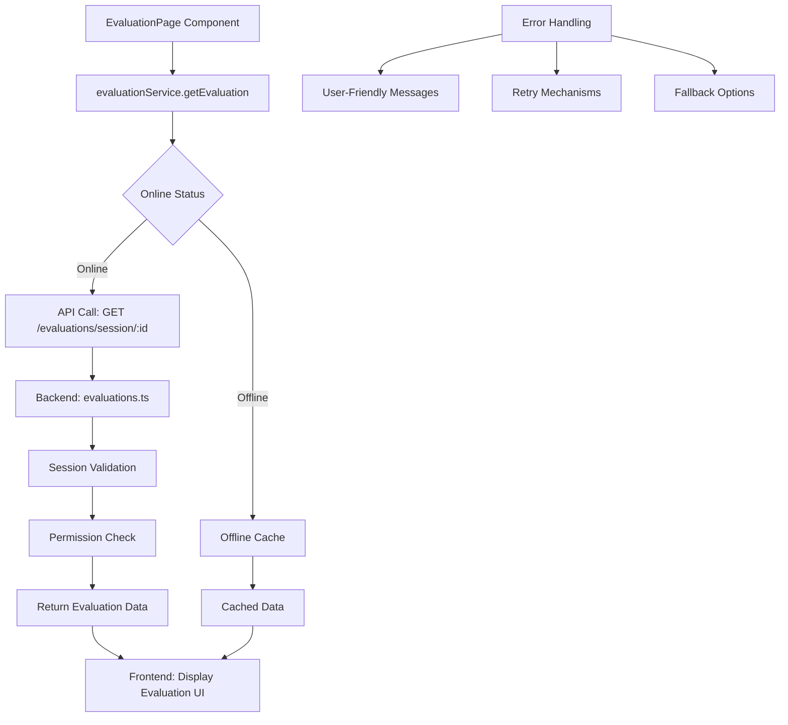

# 設計書

## 概要

評価実行画面のローディング問題を解決するための設計。現在の実装では、`EvaluationPage.tsx`の`fetchSession`関数内でモックデータを使用しているが、実際のAPI呼び出しがコメントアウトされており、適切なデータ取得とエラーハンドリングが実装されていない。また、`evaluationService.ts`では`api`オブジェクトが未定義で、実際のAPIクライアントとの接続が確立されていない。

## アーキテクチャ

### 現在の問題分析

1. **EvaluationPage.tsx の問題**:
   - `fetchSession`関数で実際のAPI呼び出しがコメントアウトされている
   - モックデータのみを使用しているが、適切な非同期処理が実装されていない
   - エラーハンドリングが不完全

2. **evaluationService.ts の問題**:
   - `api`オブジェクトが未定義（`apiClient`を使用すべき）
   - 評価データ取得のエンドポイントが間違っている（`/api/evaluations`ではなく`/evaluations`）

3. **API エンドポイントの不整合**:
   - フロントエンドが期待するデータ構造とバックエンドが返すデータ構造の不一致
   - セッション詳細取得時の関連データ（video, template）の取得方法

### 解決策のアーキテクチャ



## コンポーネントとインターフェース

### 1. EvaluationPageコンポーネントの更新

**現在の問題**:
- モックデータのハードコーディング
- 不適切な非同期処理
- エラーハンドリングの不備

**解決策**:
- `evaluationService.getEvaluation()`を使用した適切なデータ取得
- ローディング状態の適切な管理
- エラー状態の適切な表示とリトライ機能

### 2. EvaluationServiceの更新

**現在の問題**:
- `api`オブジェクトが未定義
- エンドポイントURLの不整合
- データ構造の不一致

**解決策**:
- `apiClient`の正しい使用
- 正しいエンドポイントURL（`/evaluations/session/:id`）
- データ構造の正規化

### 3. バックエンドAPIの強化

**現在の状態**:
- 基本的なAPIエンドポイントは実装済み
- セッション詳細取得は動作している

**必要な強化**:
- 評価データ取得時のレスポンス構造の最適化
- エラーレスポンスの標準化
- パフォーマンスの最適化

## データモデル

### EvaluationSessionインターフェース

```typescript
interface EvaluationSession {
  id: string;
  name: string;
  description: string;
  video: {
    id: string;
    title: string;
    youtubeId: string;
    duration?: number;
    thumbnailUrl?: string;
  };
  template: {
    id: string;
    name: string;
    description: string;
    categories: Array<{
      id: string;
      name: string;
      description: string;
      weight: number;
      criteria: Array<{
        id: string;
        name: string;
        description: string;
        weight: number;
        minScore: number;
        maxScore: number;
        isRequired: boolean;
      }>;
    }>;
    settings: {
      allowComments: boolean;
      requireAllCriteria: boolean;
      showWeights: boolean;
    };
  };
  endDate?: string;
  status: SessionStatus;
}
```

### APIレスポンス構造

```typescript
interface EvaluationDataResponse {
  status: 'success' | 'error';
  data: {
    evaluation: Evaluation;
    session: EvaluationSession;
  };
  message?: string;
}
```

## エラーハンドリング

### エラータイプとレスポンス

1. **セッションが見つからない (404)**:
   - 表示: "セッションが見つかりません"
   - アクション: セッション一覧にリダイレクト

2. **権限拒否 (403)**:
   - 表示: "このセッションの評価権限がありません"
   - アクション: 連絡先情報を表示

3. **セッション非アクティブ (400)**:
   - 表示: "このセッションは現在評価できません"
   - アクション: セッション状態と利用可能予定時刻を表示

4. **ネットワークエラー (500/Network)**:
   - 表示: "接続エラーが発生しました"
   - アクション: 指数バックオフ付きリトライボタン

### エラー回復メカニズム

1. **自動リトライ**: 指数バックオフ付きネットワークエラー対応
2. **手動リトライ**: ユーザー開始のリトライボタン
3. **フォールバックナビゲーション**: セッション一覧またはダッシュボードに戻る
4. **オフラインサポート**: 利用可能時はキャッシュデータを使用

## テスト戦略

### 単体テスト

1. **EvaluationPageコンポーネント**:
   - ローディング状態管理
   - エラー状態処理
   - データ取得成功シナリオ
   - ユーザーインタラクション処理

2. **EvaluationService**:
   - API呼び出し成功/失敗シナリオ
   - データ変換
   - オフライン/オンラインモード切り替え
   - エラーハンドリング

### 統合テスト

1. **API統合**:
   - エンドツーエンド評価データ取得
   - セッション検証
   - 権限チェック
   - エラーレスポンス処理

2. **ユーザーフローテスト**:
   - 完全な評価ワークフロー
   - エラー回復シナリオ
   - オフライン/オンライン遷移

### パフォーマンステスト

1. **ローディングパフォーマンス**:
   - 初期ページ読み込み時間
   - APIレスポンス時間
   - 大容量データセット処理

2. **エラー回復パフォーマンス**:
   - リトライメカニズムの効率性
   - フォールバック読み込み速度

## 実装フェーズ

### フェーズ1: コア修正
- `evaluationService.ts`のAPIクライアント使用を修正
- `EvaluationPage.tsx`を適切なサービス呼び出しを使用するよう更新
- 基本的なエラーハンドリングを実装

### フェーズ2: 強化されたエラーハンドリング
- 包括的なエラー状態を追加
- リトライメカニズムを実装
- ユーザーフレンドリーなエラーメッセージを追加

### フェーズ3: パフォーマンス最適化
- ローディング最適化を追加
- キャッシュ戦略を実装
- オフラインサポート強化を追加

### フェーズ4: テストと検証
- 包括的なテストスイート
- ユーザー受入テスト
- パフォーマンス検証