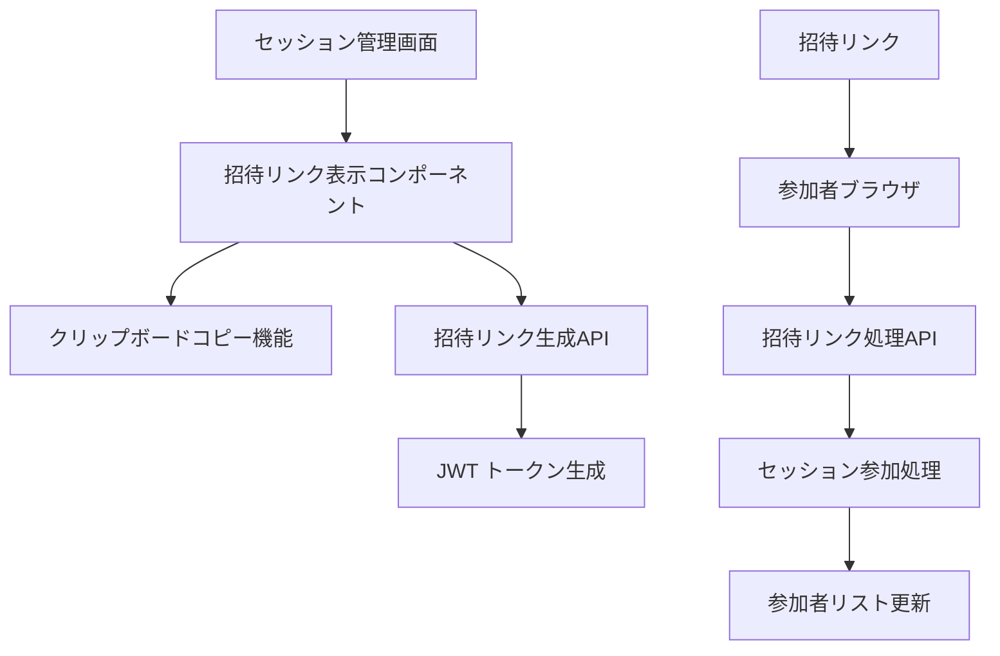

# Design Document

## Overview

セッション招待システムは、セッション管理画面に招待リンク機能を追加し、参加者がセッションに簡単に参加できるようにするシステムです。セッション作成者は招待リンクを生成・表示し、外部のSNSやコミュニケーションツールを通じて参加者と共有できます。

## Architecture

### システム構成



### データフロー

1. **招待リンク生成フロー**
   - セッション作成時に自動的に招待リンクを生成
   - JWTトークンにセッションIDと有効期限を含める
   - フロントエンドで招待リンクを表示

2. **招待リンク共有フロー**
   - ユーザーがコピーボタンをクリック
   - クリップボードAPIを使用してリンクをコピー
   - 成功/失敗のフィードバックを表示

3. **招待リンク使用フロー**
   - 参加者が招待リンクをクリック
   - トークンの検証とセッション存在確認
   - ログイン状態の確認とリダイレクト処理
   - セッション参加者リストへの追加

## Components and Interfaces

### Backend Components

#### 1. 招待リンク生成サービス
```typescript
interface InvitationService {
  generateInviteLink(sessionId: string): Promise<string>;
  validateInviteToken(token: string): Promise<InviteTokenPayload>;
  invalidateSessionInvites(sessionId: string): Promise<void>;
}

interface InviteTokenPayload {
  sessionId: string;
  type: 'session-invite';
  iat: number;
  exp: number;
}
```

#### 2. セッション招待API拡張
```typescript
// 既存のセッションルートに追加
router.get('/:id/invite-link', authenticateToken, getInviteLink);
router.post('/join/:token', joinSessionByInvite);
```

#### 3. セッションモデル拡張
```typescript
interface ISession {
  // 既存フィールド...
  inviteSettings?: {
    isEnabled: boolean;
    expiresAt?: Date;
    maxUses?: number;
    currentUses: number;
  };
}
```

### Frontend Components

#### 1. 招待リンク表示コンポーネント
```typescript
interface InviteLinkDisplayProps {
  sessionId: string;
  inviteLink: string;
  onCopy: (success: boolean) => void;
}

const InviteLinkDisplay: React.FC<InviteLinkDisplayProps>
```

#### 2. クリップボードコピーフック
```typescript
interface UseClipboardReturn {
  copyToClipboard: (text: string) => Promise<boolean>;
  isSupported: boolean;
  lastCopied: string | null;
}

const useClipboard: () => UseClipboardReturn
```

#### 3. セッション詳細ページ拡張
- 既存の `SessionDetailPage` に招待リンクセクションを追加
- セッション作成者のみに表示
- 招待リンクの使用統計を表示

## Data Models

### 招待リンク使用ログ
```typescript
interface InviteLinkUsage {
  id: string;
  sessionId: string;
  token: string;
  usedBy?: string; // ユーザーID（ログイン済みの場合）
  usedAt: Date;
  ipAddress: string;
  userAgent: string;
  success: boolean;
  errorReason?: string;
}
```

### セッション招待設定
```typescript
interface SessionInviteSettings {
  isEnabled: boolean;
  expiresAt?: Date;
  maxUses?: number;
  currentUses: number;
  allowAnonymous: boolean;
  requireApproval: boolean;
}
```

## Error Handling

### エラーケースと対応

1. **無効な招待トークン**
   - JWTの署名検証失敗
   - トークンの期限切れ
   - 不正なトークン形式
   - 対応: エラーページ表示とセッション一覧へのリンク

2. **セッション関連エラー**
   - セッションが存在しない
   - セッションが削除済み
   - セッションが非アクティブ
   - 対応: 適切なエラーメッセージと代替アクション提示

3. **権限エラー**
   - セッション作成者以外の招待リンク取得
   - 招待が無効化されたセッション
   - 対応: 403エラーと権限不足メッセージ

4. **クリップボードエラー**
   - ブラウザがクリップボードAPIをサポートしていない
   - HTTPSでない環境での制限
   - 対応: 手動コピー用のテキスト選択状態とフォールバック表示

## Testing Strategy

### Unit Tests

#### Backend
- `InvitationService.generateInviteLink()` のテスト
- `InvitationService.validateInviteToken()` のテスト
- JWT トークンの生成と検証のテスト
- セッション参加処理のテスト

#### Frontend
- `InviteLinkDisplay` コンポーネントのレンダリングテスト
- `useClipboard` フックの動作テスト
- クリップボードコピー成功/失敗のテスト
- 招待リンク表示の権限チェックテスト

### Integration Tests

#### API Integration
- 招待リンク生成APIのテスト
- 招待リンクでのセッション参加APIのテスト
- 無効なトークンでのアクセステスト
- セッション削除時の招待リンク無効化テスト

#### User Flow Tests
- セッション作成から招待リンク生成までのフロー
- 招待リンクのコピーと共有のフロー
- 参加者の招待リンクアクセスから参加完了までのフロー
- エラーケースでのユーザー体験テスト

### Security Tests

#### セキュリティ検証
- JWT トークンの改ざん検出テスト
- 期限切れトークンの拒否テスト
- 不正なセッションIDでのアクセステスト
- レート制限とDDoS対策のテスト

## Implementation Notes

### セキュリティ考慮事項

1. **JWT トークンセキュリティ**
   - 適切な有効期限設定（デフォルト7日）
   - セッション削除時の即座な無効化
   - トークンの再利用防止（必要に応じて）

2. **アクセス制御**
   - セッション作成者のみが招待リンクを取得可能
   - 招待リンクの使用ログ記録
   - 異常なアクセスパターンの検出

3. **プライバシー保護**
   - 招待リンクにセッション名などの機密情報を含めない
   - ログに記録する情報の最小化
   - GDPR準拠のデータ保持期間設定

### パフォーマンス考慮事項

1. **フロントエンド最適化**
   - 招待リンクの遅延読み込み
   - クリップボードAPIの非同期処理
   - エラー状態の適切なキャッシュ

2. **バックエンド最適化**
   - JWT検証の効率化
   - セッション存在確認のクエリ最適化
   - 招待リンク使用ログの非同期記録

### ブラウザ互換性

1. **クリップボードAPI**
   - モダンブラウザでのClipboard APIサポート
   - 古いブラウザでのフォールバック実装
   - HTTPSでない環境での制限対応

2. **JWT処理**
   - 全ブラウザでのJWT処理サポート
   - URLパラメータの適切な処理
   - 文字エンコーディングの統一

## Future Enhancements

### 将来的な機能拡張

1. **招待リンクカスタマイズ**
   - 有効期限の個別設定
   - 使用回数制限の設定
   - 招待メッセージのカスタマイズ

2. **高度な参加者管理**
   - 招待承認フロー
   - 参加者の事前登録
   - 招待状況の詳細追跡

3. **統計とアナリティクス**
   - 招待リンクの使用統計
   - 参加者の流入経路分析
   - セッション参加率の改善提案