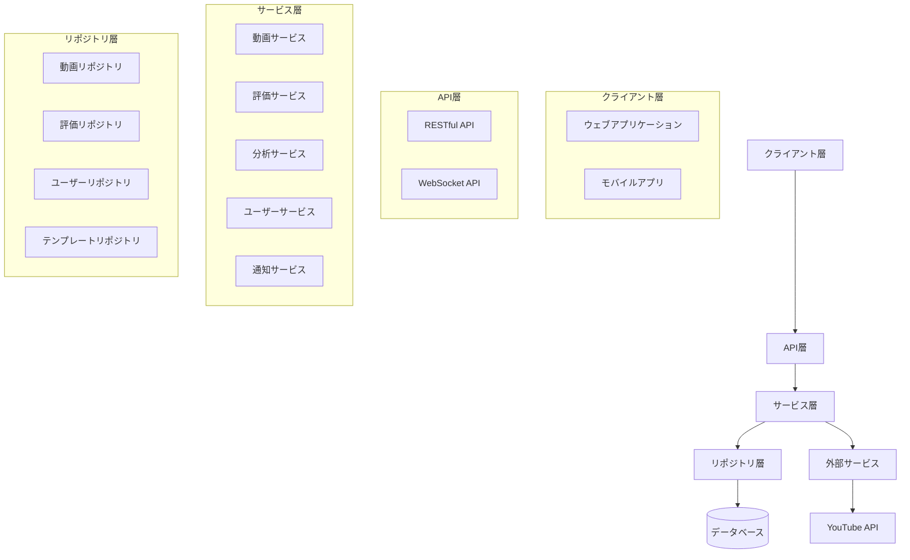
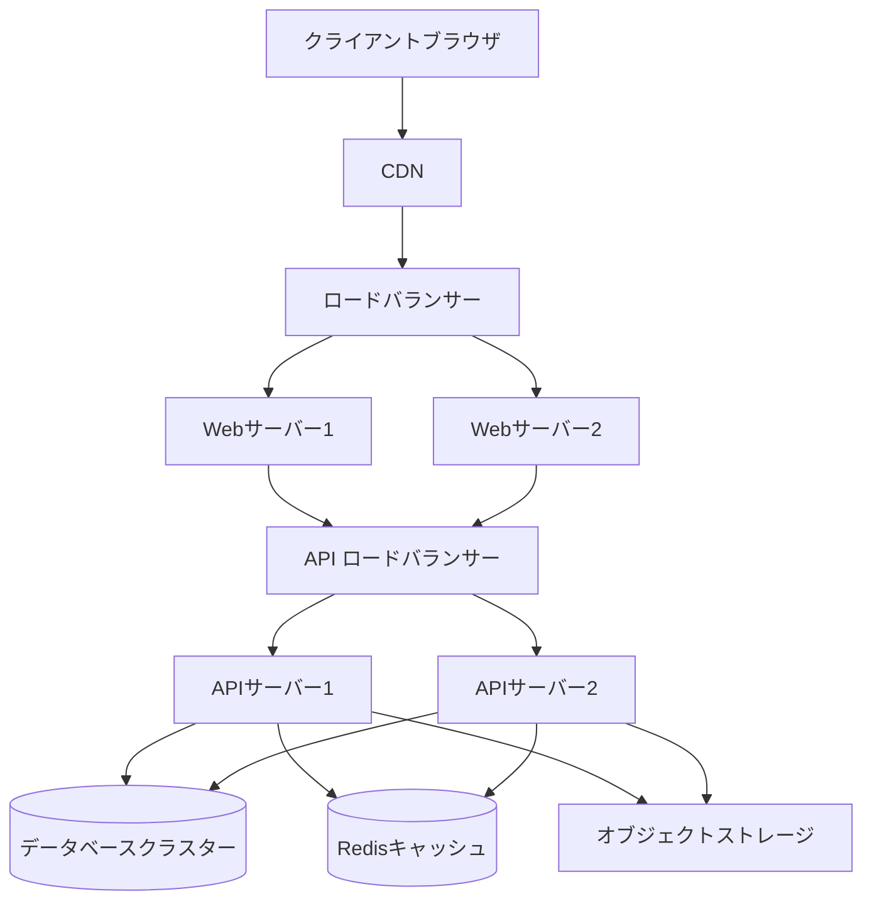
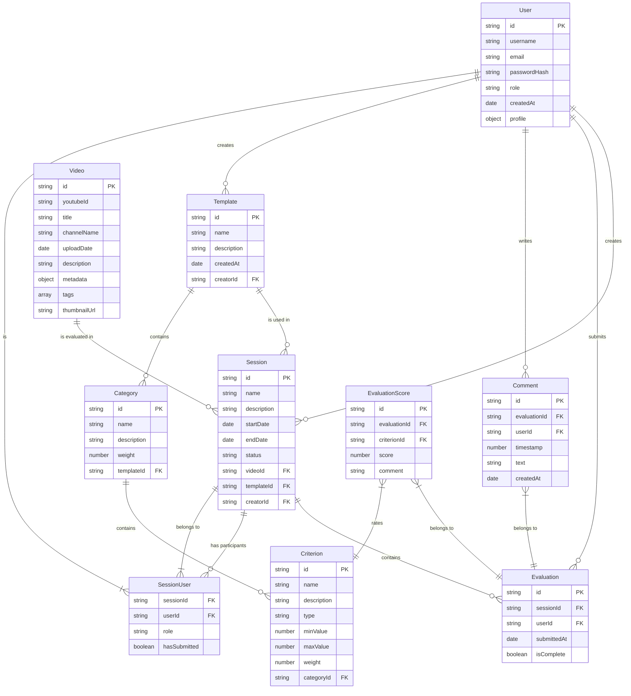

# 設計書

## 概要

YouTubeにアップロードされたYOSAKOIソーラン演舞動画を多人数で評価・共有するシステムの設計書です。このシステムは、オンライン上でよさこいソーラン演舞の評価を効率的に行い、その結果を記録・共有するためのウェブアプリケーションとして実装されます。主な機能として、YouTube動画の統合、多人数評価システム、カスタマイズ可能な評価基準、タイムライン連動評価、評価結果の可視化と分析、フィードバック共有システム、およびモバイル対応が含まれます。

## アーキテクチャ

システムは以下のアーキテクチャに基づいて構築されます：

### 全体アーキテクチャ



### 技術スタック

- **フロントエンド**：
  - React.js（SPA構築）
  - Redux（状態管理）
  - Material-UI（UIコンポーネント）
  - Chart.js（データ可視化）
  - YouTube Player API（動画再生）

- **バックエンド**：
  - Node.js + Express（APIサーバー）
  - Socket.io（リアルタイム通信）
  - Passport.js（認証）

- **データベース**：
  - MongoDB（メインデータストア）
  - Redis（キャッシュ、セッション管理）

- **インフラ**：
  - Docker（コンテナ化）
  - AWS/GCP（クラウドホスティング）
  - CI/CD（継続的インテグレーション/デリバリー）

### デプロイメント構成



## コンポーネントとインターフェース

### コアコンポーネント

1. **ユーザー管理コンポーネント**
   - ユーザー登録・認証
   - ロール管理（管理者、評価者、一般ユーザー）
   - プロフィール管理

2. **動画管理コンポーネント**
   - YouTube動画の登録・管理
   - メタデータ抽出・保存
   - カテゴリ分類

3. **評価セッション管理コンポーネント**
   - 評価セッションの作成・管理
   - 評価者の招待・管理
   - 評価期限の設定・通知

4. **評価テンプレート管理コンポーネント**
   - カスタム評価項目の定義
   - テンプレートの保存・再利用
   - 重み付け設定

5. **評価実行コンポーネント**
   - 動画再生と連動した評価入力
   - タイムスタンプ付きコメント
   - リアルタイム保存

6. **分析・可視化コンポーネント**
   - 評価データの集計
   - グラフ・チャート生成
   - 比較分析

7. **共有・通知コンポーネント**
   - 評価結果の共有管理
   - コメント・フィードバック
   - 通知配信

### インターフェース定義

#### API エンドポイント

1. **ユーザー管理 API**
   - `POST /api/auth/register` - ユーザー登録
   - `POST /api/auth/login` - ログイン
   - `GET /api/users/me` - 現在のユーザー情報取得
   - `PUT /api/users/me` - ユーザー情報更新

2. **動画管理 API**
   - `POST /api/videos` - 動画登録
   - `GET /api/videos` - 動画一覧取得
   - `GET /api/videos/:id` - 動画詳細取得
   - `PUT /api/videos/:id` - 動画情報更新
   - `DELETE /api/videos/:id` - 動画削除

3. **評価セッション API**
   - `POST /api/sessions` - セッション作成
   - `GET /api/sessions` - セッション一覧取得
   - `GET /api/sessions/:id` - セッション詳細取得
   - `PUT /api/sessions/:id` - セッション更新
   - `POST /api/sessions/:id/invite` - 評価者招待

4. **評価テンプレート API**
   - `POST /api/templates` - テンプレート作成
   - `GET /api/templates` - テンプレート一覧取得
   - `GET /api/templates/:id` - テンプレート詳細取得
   - `PUT /api/templates/:id` - テンプレート更新

5. **評価 API**
   - `POST /api/evaluations` - 評価提出
   - `GET /api/evaluations/:sessionId` - セッション評価取得
   - `POST /api/evaluations/comments` - コメント追加
   - `GET /api/evaluations/comments/:evaluationId` - コメント取得

6. **分析 API**
   - `GET /api/analytics/session/:sessionId` - セッション分析
   - `GET /api/analytics/compare?sessions=id1,id2` - セッション比較
   - `GET /api/analytics/export/:sessionId` - 分析データエクスポート

#### WebSocket イベント

1. **リアルタイム評価イベント**
   - `evaluation:update` - 評価更新通知
   - `comment:add` - コメント追加通知
   - `session:status` - セッションステータス更新

2. **通知イベント**
   - `notification:new` - 新規通知
   - `notification:read` - 通知既読

## データモデル

### エンティティ関連図



### 主要データモデル詳細

#### User（ユーザー）

```typescript
interface User {
  id: string;              // ユーザーID
  username: string;        // ユーザー名
  email: string;           // メールアドレス
  passwordHash: string;    // パスワードハッシュ
  role: UserRole;          // ロール（管理者、評価者、一般ユーザー）
  createdAt: Date;         // 作成日時
  profile: {
    displayName?: string;  // 表示名
    avatar?: string;       // アバターURL
    bio?: string;          // 自己紹介
    expertise?: string[];  // 専門分野
  };
}

enum UserRole {
  ADMIN = 'admin',
  EVALUATOR = 'evaluator',
  USER = 'user'
}
```

#### Video（動画）

```typescript
interface Video {
  id: string;              // 動画ID
  youtubeId: string;       // YouTube動画ID
  title: string;           // タイトル
  channelName: string;     // チャンネル名
  uploadDate: Date;        // アップロード日
  description: string;     // 説明
  metadata: {
    teamName?: string;     // チーム名
    performanceName?: string; // 演舞名
    eventName?: string;    // 大会名
    year?: number;         // 年度
    location?: string;     // 場所
  };
  tags: string[];          // タグ
  thumbnailUrl: string;    // サムネイルURL
  createdAt: Date;         // 登録日時
  createdBy: string;       // 登録者ID
}
```

#### Template（評価テンプレート）

```typescript
interface Template {
  id: string;              // テンプレートID
  name: string;            // テンプレート名
  description: string;     // 説明
  createdAt: Date;         // 作成日時
  creatorId: string;       // 作成者ID
  categories: Category[];  // カテゴリ一覧
}

interface Category {
  id: string;              // カテゴリID
  name: string;            // カテゴリ名
  description: string;     // 説明
  weight: number;          // 重み（0-1）
  criteria: Criterion[];   // 評価基準一覧
}

interface Criterion {
  id: string;              // 評価基準ID
  name: string;            // 評価基準名
  description: string;     // 説明
  type: CriterionType;     // 評価タイプ
  minValue: number;        // 最小値
  maxValue: number;        // 最大値
  weight: number;          // 重み（0-1）
}

enum CriterionType {
  NUMERIC = 'numeric',     // 数値評価
  SCALE = 'scale',         // スケール評価
  BOOLEAN = 'boolean'      // はい/いいえ評価
}
```

#### Session（評価セッション）

```typescript
interface Session {
  id: string;              // セッションID
  name: string;            // セッション名
  description: string;     // 説明
  startDate: Date;         // 開始日時
  endDate: Date;           // 終了日時
  status: SessionStatus;   // ステータス
  videoId: string;         // 評価対象動画ID
  templateId: string;      // 使用テンプレートID
  creatorId: string;       // 作成者ID
  participants: SessionUser[]; // 参加者一覧
  createdAt: Date;         // 作成日時
  settings: {
    isAnonymous: boolean;  // 匿名評価か
    showResultsAfterSubmit: boolean; // 提出後に結果を表示するか
    allowComments: boolean; // コメント許可
  };
}

enum SessionStatus {
  DRAFT = 'draft',         // 下書き
  ACTIVE = 'active',       // アクティブ
  COMPLETED = 'completed', // 完了
  ARCHIVED = 'archived'    // アーカイブ
}

interface SessionUser {
  sessionId: string;       // セッションID
  userId: string;          // ユーザーID
  role: SessionUserRole;   // セッション内ロール
  hasSubmitted: boolean;   // 評価提出済みか
  invitedAt: Date;         // 招待日時
  joinedAt?: Date;         // 参加日時
}

enum SessionUserRole {
  OWNER = 'owner',         // オーナー
  EVALUATOR = 'evaluator', // 評価者
  OBSERVER = 'observer'    // オブザーバー
}
```

#### Evaluation（評価）

```typescript
interface Evaluation {
  id: string;              // 評価ID
  sessionId: string;       // セッションID
  userId: string;          // 評価者ID
  submittedAt: Date;       // 提出日時
  isComplete: boolean;     // 完了フラグ
  scores: EvaluationScore[]; // スコア一覧
  comments: Comment[];     // コメント一覧
}

interface EvaluationScore {
  id: string;              // スコアID
  evaluationId: string;    // 評価ID
  criterionId: string;     // 評価基準ID
  score: number;           // スコア値
  comment?: string;        // コメント
}

interface Comment {
  id: string;              // コメントID
  evaluationId: string;    // 評価ID
  userId: string;          // ユーザーID
  timestamp: number;       // 動画タイムスタンプ（秒）
  text: string;            // コメント内容
  createdAt: Date;         // 作成日時
}
```

## エラー処理

### エラーカテゴリ

1. **認証・認可エラー**
   - 未認証エラー（401）
   - アクセス権限エラー（403）
   - セッション期限切れ（440）

2. **入力検証エラー**
   - 必須フィールド欠落（400）
   - 形式不正（400）
   - 値範囲外（400）

3. **リソースエラー**
   - リソース未検出（404）
   - リソース競合（409）
   - リソース上限到達（429）

4. **外部サービスエラー**
   - YouTube API エラー
   - データベース接続エラー
   - ネットワークエラー

5. **システムエラー**
   - 内部サーバーエラー（500）
   - サービス利用不可（503）

### エラー処理戦略

1. **フロントエンドエラー処理**
   - グローバルエラーハンドラーによる一貫した処理
   - ユーザーフレンドリーなエラーメッセージ表示
   - 必要に応じた自動リトライ
   - フォーム入力のリアルタイムバリデーション

2. **バックエンドエラー処理**
   - 構造化されたエラーレスポンス
   - 詳細なエラーログ記録
   - 重大エラーの自動通知
   - トランザクション管理によるデータ整合性確保

3. **エラーレスポンス形式**

```json
{
  "status": "error",
  "code": "RESOURCE_NOT_FOUND",
  "message": "指定された動画は見つかりませんでした",
  "details": {
    "resourceType": "video",
    "resourceId": "123456",
    "reason": "deleted"
  },
  "requestId": "req-123-456-789"
}
```

## テスト戦略

### テストレベル

1. **単体テスト**
   - 各コンポーネントの機能テスト
   - サービスロジックのテスト
   - データモデルのバリデーションテスト

2. **統合テスト**
   - API エンドポイントテスト
   - コンポーネント間連携テスト
   - データベース操作テスト

3. **E2Eテスト**
   - ユーザーフローテスト
   - クロスブラウザテスト
   - モバイル互換性テスト

### テスト自動化

1. **CI/CDパイプライン統合**
   - プルリクエスト時の自動テスト実行
   - デプロイ前の全テスト実行
   - テストカバレッジレポート生成

2. **テストデータ管理**
   - テスト用データセット作成
   - テスト環境の自動セットアップ
   - テスト後のクリーンアップ

3. **パフォーマンステスト**
   - 負荷テスト（同時評価者数の上限テスト）
   - スケーラビリティテスト
   - レスポンスタイム測定

### テストツール

- Jest（単体テスト）
- Supertest（API テスト）
- Cypress（E2E テスト）
- k6（パフォーマンステスト）

## セキュリティ対策

1. **認証・認可**
   - JWT ベースの認証
   - ロールベースのアクセス制御
   - OAuth2.0 によるソーシャルログイン

2. **データ保護**
   - センシティブデータの暗号化
   - HTTPS 通信の強制
   - CSRF 対策

3. **入力検証**
   - すべてのユーザー入力の検証
   - SQLインジェクション対策
   - XSS 対策

4. **レート制限**
   - API コールのレート制限
   - アカウント作成・ログイン試行の制限
   - IP ベースの制限

5. **監査とログ**
   - セキュリティイベントのログ記録
   - ユーザーアクションの監査証跡
   - 異常検知と通知

## パフォーマンス最適化

1. **フロントエンド最適化**
   - コード分割とレイジーローディング
   - 画像・アセットの最適化
   - キャッシュ戦略

2. **バックエンド最適化**
   - データベースインデックス最適化
   - クエリパフォーマンスチューニング
   - キャッシュレイヤー（Redis）

3. **動画再生最適化**
   - 適応ビットレートストリーミング
   - プリロードと先読み
   - 低帯域幅環境への対応

4. **モバイル最適化**
   - レスポンシブデザイン
   - タッチ操作の最適化
   - オフラインサポート

## スケーラビリティ計画

1. **水平スケーリング**
   - ステートレスAPIサーバー
   - ロードバランシング
   - コンテナオーケストレーション

2. **データベーススケーリング**
   - シャーディング戦略
   - レプリケーション
   - 読み取り/書き込み分離

3. **キャッシュ戦略**
   - 分散キャッシュ
   - CDN 活用
   - エッジキャッシング

4. **マイクロサービス移行計画**
   - 将来的なサービス分割の検討
   - イベント駆動アーキテクチャ
   - API ゲートウェイ導入