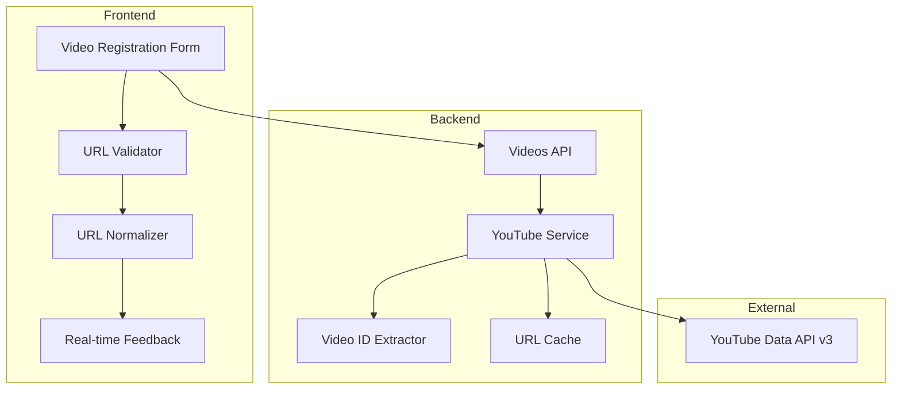

# YouTube URL バリデーション改善 - 設計書

## 概要

YouTube URLのバリデーション機能を改善し、ユーザーがブラウザからコピーした様々な形式のURLを受け入れられるようにする。同時に、より分かりやすいエラーメッセージとリアルタイムフィードバックを提供する。

## アーキテクチャ

### システム構成図



## コンポーネント設計

### 1. URL正規化エンジン

#### URLパターン定義

```typescript
interface URLPattern {
  pattern: RegExp;
  extractor: (match: RegExpMatchArray) => string | null;
  description: string;
}

const YOUTUBE_URL_PATTERNS: URLPattern[] = [
  // 標準的なwatch URL
  {
    pattern: /^https?:\/\/(www\.|m\.)?youtube\.com\/watch\?.*v=([a-zA-Z0-9_-]{11})/,
    extractor: (match) => match[2],
    description: "標準的なYouTube URL"
  },
  // 短縮URL
  {
    pattern: /^https?:\/\/youtu\.be\/([a-zA-Z0-9_-]{11})/,
    extractor: (match) => match[1],
    description: "YouTube短縮URL"
  },
  // 埋め込みURL
  {
    pattern: /^https?:\/\/(www\.)?youtube\.com\/embed\/([a-zA-Z0-9_-]{11})/,
    extractor: (match) => match[2],
    description: "YouTube埋め込みURL"
  },
  // プロトコルなし
  {
    pattern: /^(www\.|m\.)?youtube\.com\/watch\?.*v=([a-zA-Z0-9_-]{11})/,
    extractor: (match) => match[2],
    description: "プロトコルなしYouTube URL"
  }
];
```

#### URL正規化クラス

```typescript
class YouTubeURLNormalizer {
  static normalize(url: string): NormalizedURL {
    // プロトコル補完
    const normalizedUrl = this.addProtocolIfMissing(url);
    
    // ビデオID抽出
    const videoId = this.extractVideoId(normalizedUrl);
    
    if (!videoId) {
      throw new URLValidationError('有効なYouTube URLではありません');
    }
    
    // 正規化されたURLを生成
    const canonicalUrl = `https://www.youtube.com/watch?v=${videoId}`;
    
    return {
      original: url,
      canonical: canonicalUrl,
      videoId: videoId,
      isValid: true
    };
  }
  
  private static addProtocolIfMissing(url: string): string {
    if (!/^https?:\/\//.test(url)) {
      return `https://${url}`;
    }
    return url;
  }
  
  private static extractVideoId(url: string): string | null {
    for (const pattern of YOUTUBE_URL_PATTERNS) {
      const match = url.match(pattern.pattern);
      if (match) {
        return pattern.extractor(match);
      }
    }
    return null;
  }
}
```

### 2. エラーメッセージシステム

#### エラー分類

```typescript
enum URLValidationErrorType {
  INVALID_FORMAT = 'INVALID_FORMAT',
  NOT_YOUTUBE = 'NOT_YOUTUBE',
  MISSING_VIDEO_ID = 'MISSING_VIDEO_ID',
  PRIVATE_VIDEO = 'PRIVATE_VIDEO',
  VIDEO_NOT_FOUND = 'VIDEO_NOT_FOUND',
  NETWORK_ERROR = 'NETWORK_ERROR'
}

interface ValidationError {
  type: URLValidationErrorType;
  message: string;
  suggestion?: string;
  example?: string;
}
```

#### エラーメッセージマッピング

```typescript
const ERROR_MESSAGES: Record<URLValidationErrorType, ValidationError> = {
  [URLValidationErrorType.INVALID_FORMAT]: {
    type: URLValidationErrorType.INVALID_FORMAT,
    message: 'URLの形式が正しくありません',
    suggestion: '完全なYouTube URLを入力してください',
    example: 'https://www.youtube.com/watch?v=dQw4w9WgXcQ'
  },
  [URLValidationErrorType.NOT_YOUTUBE]: {
    type: URLValidationErrorType.NOT_YOUTUBE,
    message: 'YouTube以外のURLは登録できません',
    suggestion: 'YouTube（youtube.com または youtu.be）のURLを入力してください'
  },
  [URLValidationErrorType.PRIVATE_VIDEO]: {
    type: URLValidationErrorType.PRIVATE_VIDEO,
    message: 'この動画は非公開のため登録できません',
    suggestion: '公開されている動画のURLを使用してください'
  }
  // ... 他のエラータイプ
};
```

### 3. リアルタイムバリデーション

#### フロントエンドバリデーター

```typescript
class RealTimeURLValidator {
  private debounceTimer: NodeJS.Timeout | null = null;
  private readonly DEBOUNCE_DELAY = 500;
  
  validate(url: string, callback: (result: ValidationResult) => void): void {
    // デバウンス処理
    if (this.debounceTimer) {
      clearTimeout(this.debounceTimer);
    }
    
    this.debounceTimer = setTimeout(() => {
      this.performValidation(url, callback);
    }, this.DEBOUNCE_DELAY);
  }
  
  private async performValidation(
    url: string, 
    callback: (result: ValidationResult) => void
  ): Promise<void> {
    try {
      // 基本的な形式チェック
      const normalized = YouTubeURLNormalizer.normalize(url);
      
      // 重複チェック（ローカルキャッシュ）
      const isDuplicate = await this.checkDuplicate(normalized.videoId);
      
      callback({
        isValid: true,
        normalized: normalized,
        isDuplicate: isDuplicate,
        message: isDuplicate ? '既に登録済みの動画です' : '有効なYouTube URLです'
      });
      
    } catch (error) {
      callback({
        isValid: false,
        error: error as ValidationError,
        suggestion: this.generateSuggestion(url)
      });
    }
  }
  
  private generateSuggestion(url: string): string {
    if (!url.includes('youtube.com') && !url.includes('youtu.be')) {
      return 'YouTube URLを入力してください（例: https://www.youtube.com/watch?v=...）';
    }
    
    if (!url.includes('v=') && !url.includes('youtu.be/')) {
      return 'ビデオIDが含まれていません。完全なYouTube URLを入力してください';
    }
    
    return '正しいYouTube URLの形式で入力してください';
  }
}
```

### 4. バックエンドサービス改善

#### YouTubeService拡張

```typescript
class EnhancedYouTubeService extends YouTubeService {
  /**
   * 拡張されたビデオID抽出メソッド
   */
  extractVideoId(url: string): string | null {
    try {
      const normalized = YouTubeURLNormalizer.normalize(url);
      return normalized.videoId;
    } catch (error) {
      // ログ出力してnullを返す
      console.warn('Failed to extract video ID from URL:', url, error);
      return null;
    }
  }
  
  /**
   * URL検証とビデオ情報取得を統合
   */
  async validateAndGetVideoInfo(url: string): Promise<VideoValidationResult> {
    try {
      // URL正規化
      const normalized = YouTubeURLNormalizer.normalize(url);
      
      // 重複チェック
      const existingVideo = await Video.findOne({ youtubeId: normalized.videoId });
      if (existingVideo) {
        return {
          isValid: false,
          error: {
            type: URLValidationErrorType.DUPLICATE_VIDEO,
            message: 'この動画は既に登録されています',
            existingVideo: existingVideo
          }
        };
      }
      
      // YouTube API呼び出し
      const videoInfo = await this.getVideoInfo(normalized.videoId);
      
      // 公開状態チェック
      const isPublic = await this.isVideoPublic(normalized.videoId);
      if (!isPublic) {
        return {
          isValid: false,
          error: {
            type: URLValidationErrorType.PRIVATE_VIDEO,
            message: '非公開動画は登録できません'
          }
        };
      }
      
      return {
        isValid: true,
        normalized: normalized,
        videoInfo: videoInfo,
        canRegister: true
      };
      
    } catch (error) {
      return this.handleValidationError(error);
    }
  }
  
  private handleValidationError(error: any): VideoValidationResult {
    if (error.code === 'VIDEO_NOT_FOUND') {
      return {
        isValid: false,
        error: {
          type: URLValidationErrorType.VIDEO_NOT_FOUND,
          message: '指定された動画が見つかりません',
          suggestion: 'URLが正しいか確認してください'
        }
      };
    }
    
    if (error.code === 'API_QUOTA_EXCEEDED') {
      return {
        isValid: false,
        error: {
          type: URLValidationErrorType.NETWORK_ERROR,
          message: 'YouTube APIの利用制限に達しました',
          suggestion: 'しばらく時間をおいてから再試行してください'
        }
      };
    }
    
    return {
      isValid: false,
      error: {
        type: URLValidationErrorType.NETWORK_ERROR,
        message: '動画情報の取得に失敗しました',
        suggestion: 'ネットワーク接続を確認してください'
      }
    };
  }
}
```

### 5. フロントエンドUI改善

#### 改善されたURL入力フィールド

```typescript
const EnhancedURLInput: React.FC<URLInputProps> = ({ 
  value, 
  onChange, 
  onValidation 
}) => {
  const [validationState, setValidationState] = useState<ValidationState>('idle');
  const [validationResult, setValidationResult] = useState<ValidationResult | null>(null);
  const validator = useRef(new RealTimeURLValidator());
  
  const handleChange = (event: React.ChangeEvent<HTMLInputElement>) => {
    const newValue = event.target.value;
    onChange(newValue);
    
    if (newValue.trim()) {
      setValidationState('validating');
      validator.current.validate(newValue, (result) => {
        setValidationResult(result);
        setValidationState(result.isValid ? 'valid' : 'invalid');
        onValidation(result);
      });
    } else {
      setValidationState('idle');
      setValidationResult(null);
    }
  };
  
  const getInputProps = () => {
    const baseProps = {
      fullWidth: true,
      label: 'YouTube URL',
      placeholder: 'https://www.youtube.com/watch?v=... または https://youtu.be/...',
      value: value,
      onChange: handleChange
    };
    
    switch (validationState) {
      case 'validating':
        return {
          ...baseProps,
          InputProps: {
            endAdornment: <CircularProgress size={20} />
          }
        };
      case 'valid':
        return {
          ...baseProps,
          color: 'success' as const,
          InputProps: {
            endAdornment: <CheckCircleIcon color="success" />
          },
          helperText: validationResult?.message
        };
      case 'invalid':
        return {
          ...baseProps,
          error: true,
          helperText: validationResult?.error?.message,
          InputProps: {
            endAdornment: <ErrorIcon color="error" />
          }
        };
      default:
        return baseProps;
    }
  };
  
  return (
    <Box>
      <TextField {...getInputProps()} />
      
      {validationResult?.error?.suggestion && (
        <Alert severity="info" sx={{ mt: 1 }}>
          <AlertTitle>修正提案</AlertTitle>
          {validationResult.error.suggestion}
          {validationResult.error.example && (
            <Box sx={{ mt: 1 }}>
              <Typography variant="caption">
                例: <code>{validationResult.error.example}</code>
              </Typography>
            </Box>
          )}
        </Alert>
      )}
      
      {validationResult?.isDuplicate && (
        <Alert severity="warning" sx={{ mt: 1 }}>
          この動画は既に登録されています
        </Alert>
      )}
    </Box>
  );
};
```

## データモデル

### URL正規化結果

```typescript
interface NormalizedURL {
  original: string;      // 元のURL
  canonical: string;     // 正規化されたURL
  videoId: string;       // 抽出されたビデオID
  isValid: boolean;      // 有効性
  metadata?: {
    timestamp?: number;  // タイムスタンプ（秒）
    playlist?: string;   // プレイリストID
    index?: number;      // プレイリスト内のインデックス
  };
}
```

### バリデーション結果

```typescript
interface ValidationResult {
  isValid: boolean;
  normalized?: NormalizedURL;
  videoInfo?: YouTubeVideoInfo;
  error?: ValidationError;
  isDuplicate?: boolean;
  message?: string;
  suggestion?: string;
}
```

## エラーハンドリング

### エラー階層

```
ValidationError
├── URLFormatError
│   ├── InvalidProtocolError
│   ├── MissingVideoIdError
│   └── UnsupportedDomainError
├── VideoAccessError
│   ├── PrivateVideoError
│   ├── DeletedVideoError
│   └── RegionBlockedError
└── NetworkError
    ├── APIQuotaExceededError
    ├── TimeoutError
    └── ConnectionError
```

### エラー処理戦略

1. **段階的検証**: URL形式 → ビデオ存在 → アクセス権限
2. **ユーザーフレンドリーメッセージ**: 技術的詳細を隠し、解決策を提示
3. **自動修復提案**: 一般的な間違いに対する修正案を提供
4. **ログ記録**: デバッグ用の詳細情報を記録

## テスト戦略

### 単体テスト

- URL正規化ロジック
- ビデオID抽出
- エラーメッセージ生成
- バリデーション結果判定

### 統合テスト

- フロントエンド-バックエンド連携
- YouTube API呼び出し
- エラーハンドリングフロー

### E2Eテスト

- 様々なURL形式での動画登録
- エラーケースでのユーザー体験
- リアルタイムフィードバック

## パフォーマンス考慮事項

### 最適化戦略

1. **デバウンス**: リアルタイム検証の頻度制限
2. **キャッシュ**: 重複チェック結果のキャッシュ
3. **並列処理**: URL検証とビデオ情報取得の並列実行
4. **プリフェッチ**: よく使われるビデオ情報の事前取得

### メトリクス

- URL検証の応答時間
- YouTube API呼び出し回数
- キャッシュヒット率
- エラー発生率

## セキュリティ考慮事項

### 入力検証

- XSS攻撃防止のためのURL サニタイゼーション
- SQLインジェクション防止
- レート制限による DoS 攻撃防止

### プライバシー

- ユーザーが入力したURLのログ記録制限
- 個人情報を含む可能性のあるクエリパラメータの除去

## 運用・監視

### ログ記録

- URL検証の成功/失敗率
- よく使われるURL形式の統計
- エラーパターンの分析

### アラート

- YouTube API エラー率の急増
- 特定のエラータイプの頻発
- 応答時間の劣化

この設計により、ユーザーは様々な形式のYouTube URLを自然に使用でき、問題が発生した場合も適切なガイダンスを受けることができます。