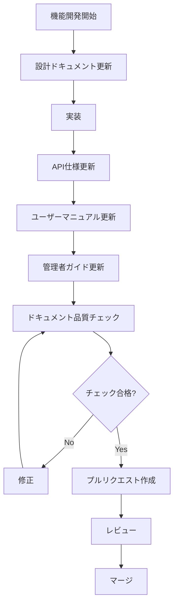
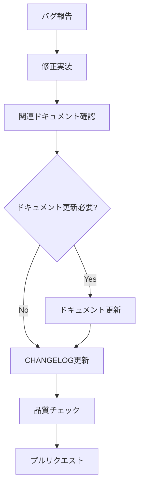
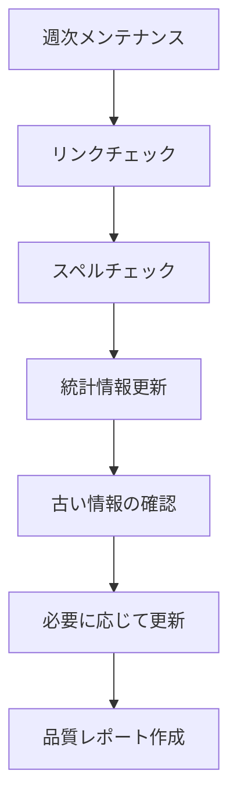

# ドキュメント更新プロセス

## 概要

このドキュメントでは、よさこいパフォーマンス評価システムのドキュメント作成・更新・保守のプロセスについて説明します。

## ドキュメント構造

### 必須ドキュメント

| ファイル名 | 目的 | 対象読者 | 更新頻度 |
|------------|------|----------|----------|
| `user-manual.md` | エンドユーザー向け操作説明 | 一般ユーザー、評価者 | 機能追加時 |
| `admin-guide.md` | システム管理者向けガイド | システム管理者 | 設定変更時 |
| `developer-guide.md` | 開発者向け技術情報 | 開発者 | 技術変更時 |
| `api-documentation.md` | API仕様書 | 開発者、統合担当者 | API変更時 |
| `architecture.md` | システムアーキテクチャ | 開発者、アーキテクト | 設計変更時 |
| `CHANGELOG.md` | 変更履歴 | 全ユーザー | リリース時 |
| `glossary.md` | 用語集 | 全ユーザー | 用語追加時 |

### 補助ドキュメント

| ファイル名 | 目的 | 更新頻度 |
|------------|------|----------|
| `DOCUMENTATION_PROCESS.md` | ドキュメント作成プロセス | プロセス変更時 |
| `openapi.yaml` | OpenAPI仕様（自動生成） | API変更時 |
| `docs-stats.json` | ドキュメント統計（自動生成） | 日次 |
| `api-stats.json` | API統計（自動生成） | API変更時 |

## ドキュメント作成・更新フロー

### 1. 新機能開発時



### 2. バグ修正時



### 3. 定期メンテナンス



## 品質基準

### Markdownフォーマット

- **リンター**: markdownlint を使用
- **設定ファイル**: `.markdownlint.json`
- **主要ルール**:
  - 見出しの前後に空行
  - コードブロックの前後に空行
  - 行末スペースの禁止
  - ファイル末尾の改行

### リンク品質

- **チェックツール**: markdown-link-check
- **設定ファイル**: `.markdown-link-check.json`
- **チェック対象**:
  - 内部リンク（相対パス）
  - 外部リンク（HTTP/HTTPS）
  - アンカーリンク（#section）

### スペルチェック

- **チェックツール**: cspell
- **設定ファイル**: `cspell.json`
- **対象言語**: 英語、日本語
- **カスタム辞書**: プロジェクト固有の用語を登録

### 構造チェック

- **必須セクション**: 各ドキュメントタイプごとに定義
- **目次の整合性**: 見出しとリンクの一致
- **相互参照**: ドキュメント間のリンク整合性

## 自動化ツール

### GitHub Actions

#### ドキュメント品質チェック（`.github/workflows/docs-quality.yml`）

- **トリガー**: プッシュ、プルリクエスト
- **チェック内容**:
  - Markdownリント
  - リンクチェック
  - スペルチェック
  - 構造チェック
  - 目次自動生成

#### 実行例

```bash
# 手動でのチェック実行
npm run docs:check

# 個別チェック
npm run docs:lint
npm run docs:links
npm run docs:spell
```

### ローカル開発ツール

#### ドキュメントメンテナンススクリプト

```bash
# 全チェック実行
./scripts/docs-maintenance.sh

# 個別チェック
./scripts/docs-maintenance.sh --lint-only
./scripts/docs-maintenance.sh --links-only
./scripts/docs-maintenance.sh --spell-only

# API仕様生成
./scripts/docs-maintenance.sh --generate-api

# 統計情報生成
./scripts/docs-maintenance.sh --stats-only
```

#### API仕様自動生成

```bash
# API仕様の自動生成
npm run docs:generate-api

# 生成されるファイル
# - docs/openapi.yaml
# - docs/api-stats.json
# - docs/api-documentation.md (更新)
```

## 執筆ガイドライン

### 文体・表現

#### ユーザーマニュアル

- **基本文体**: 丁寧語（です・ます調）
- **操作説明**: 「〜してください」「〜します」
- **注意事項**: 「〜にご注意ください」

例：
```markdown
1. ログインボタンをクリックしてください
2. メールアドレスを入力します
3. パスワードの入力にご注意ください
```

#### 管理者ガイド

- **基本文体**: 丁寧語（です・ます調）
- **手順説明**: 「〜してください」「〜を実行します」
- **警告**: 「〜しないでください」

例：
```markdown
以下のコマンドを実行してください：
```bash
docker-compose restart
```
本番環境では実行しないでください。
```

#### 技術文書（開発者ガイド、API仕様書）

- **基本文体**: 常体（である調）
- **説明**: 「〜する」「〜である」
- **推奨事項**: 「〜すべきである」「〜することを推奨する」

例：
```markdown
この関数は非同期で実行される。
エラーハンドリングを実装すべきである。
TypeScriptの使用を推奨する。
```

### 用語統一

- **参照**: `docs/glossary.md` を参照
- **新用語**: 用語集に追加してから使用
- **略語**: 初出時は正式名称を併記

### コードブロック

#### 言語指定

```markdown
```typescript
const example: string = 'TypeScript code';
```

```bash
npm install package-name
```

```json
{
  "key": "value"
}
```
```

#### インラインコード

- ファイル名: `package.json`
- コマンド: `npm run dev`
- 変数名: `userId`
- API エンドポイント: `GET /api/users`

### 画像・図表

#### ファイル命名規則

```
docs/images/
├── architecture/
│   ├── system-overview.png
│   └── database-schema.png
├── ui/
│   ├── login-screen.png
│   └── dashboard-overview.png
└── diagrams/
    ├── user-flow.png
    └── api-sequence.png
```

#### 参照方法

```markdown


*図1: システム全体のアーキテクチャ*
```

## レビュープロセス

### ドキュメントレビューチェックリスト

#### 内容レビュー

- [ ] 情報の正確性
- [ ] 実装との整合性
- [ ] 対象読者への適切性
- [ ] 完全性（必要な情報がすべて含まれている）

#### 品質レビュー

- [ ] Markdownフォーマットの正確性
- [ ] リンクの有効性
- [ ] スペルチェック合格
- [ ] 用語統一の遵守

#### 構造レビュー

- [ ] 論理的な構成
- [ ] 適切な見出し階層
- [ ] 目次との整合性
- [ ] 他ドキュメントとの整合性

### レビュー担当者

| ドキュメントタイプ | 主担当者 | 副担当者 |
|-------------------|----------|----------|
| ユーザーマニュアル | プロダクトマネージャー | UXデザイナー |
| 管理者ガイド | インフラエンジニア | システム管理者 |
| 開発者ガイド | リードエンジニア | シニアエンジニア |
| API仕様書 | バックエンドエンジニア | フロントエンドエンジニア |
| アーキテクチャ | アーキテクト | リードエンジニア |

## 継続的改善

### メトリクス

#### 品質メトリクス

- Markdownリントエラー数
- リンク切れ数
- スペルエラー数
- レビュー指摘事項数

#### 利用メトリクス

- ドキュメントアクセス数
- ユーザーフィードバック
- サポート問い合わせ数
- ドキュメント起因のバグ報告数

#### 保守メトリクス

- ドキュメント更新頻度
- 更新遅延日数
- 自動化カバレッジ
- レビュー完了時間

### 改善プロセス

#### 月次レビュー

1. **メトリクス分析**: 品質・利用・保守メトリクスの分析
2. **問題特定**: 改善が必要な領域の特定
3. **改善計画**: 具体的な改善アクションの策定
4. **実行**: 改善アクションの実行

#### 四半期レビュー

1. **プロセス評価**: ドキュメント作成プロセスの効果測定
2. **ツール評価**: 自動化ツールの効果測定
3. **ガイドライン更新**: 執筆ガイドラインの見直し
4. **トレーニング**: チームメンバーへのトレーニング実施

## トラブルシューティング

### よくある問題

#### Markdownリントエラー

**問題**: MD022 エラー（見出しの前後に空行がない）

**解決方法**:
```bash
# 自動修正
npm run docs:lint:fix

# 手動修正
# 見出しの前後に空行を追加
```

#### リンク切れ

**問題**: 外部リンクが無効

**解決方法**:
1. リンク先の確認
2. 代替URLの検索
3. アーカイブサイトの利用
4. リンクの削除（情報が古い場合）

#### スペルエラー

**問題**: 専門用語がエラーとして検出される

**解決方法**:
```json
// cspell.json に用語を追加
{
  "words": [
    "yosakoi",
    "新しい専門用語"
  ]
}
```

#### API仕様の不整合

**問題**: 実装とドキュメントの不一致

**解決方法**:
1. 実装の確認
2. API仕様の更新
3. 自動生成スクリプトの実行
4. 統合テストの実行

### サポート

#### 内部サポート

- **Slack チャンネル**: #docs-support
- **担当者**: ドキュメンテーションチーム
- **対応時間**: 平日 9:00-18:00

#### 外部リソース

- [Markdown Guide](https://www.markdownguide.org/)
- [markdownlint Rules](https://github.com/DavidAnson/markdownlint/blob/main/doc/Rules.md)
- [OpenAPI Specification](https://swagger.io/specification/)

## 付録

### テンプレート

#### 新機能ドキュメントテンプレート

```markdown
# 機能名

## 概要

機能の概要説明

## 対象ユーザー

- ユーザータイプ1
- ユーザータイプ2

## 前提条件

- 前提条件1
- 前提条件2

## 使用方法

### 基本的な使用方法

1. 手順1
2. 手順2
3. 手順3

### 高度な使用方法

詳細な使用方法

## 注意事項

- 注意事項1
- 注意事項2

## 関連情報

- [関連ドキュメント1](./related-doc1.md)
- [関連ドキュメント2](./related-doc2.md)
```

#### APIエンドポイントテンプレート

```markdown
### エンドポイント名

```http
METHOD /api/endpoint
```

**説明**: エンドポイントの説明

**認証**: 必要/不要

**パラメーター**:

| パラメーター | 型 | 必須 | 説明 |
|-------------|----|----|------|
| param1 | string | Yes | パラメーター1の説明 |
| param2 | number | No | パラメーター2の説明 |

**リクエスト例**:

```json
{
  "param1": "value1",
  "param2": 123
}
```

**レスポンス例**:

```json
{
  "status": "success",
  "data": {
    "result": "value"
  }
}
```

**エラーレスポンス**:

| ステータスコード | 説明 |
|-----------------|------|
| 400 | Bad Request |
| 401 | Unauthorized |
| 500 | Internal Server Error |
```

### チェックリスト

#### プルリクエスト前チェックリスト

- [ ] Markdownリント合格
- [ ] リンクチェック合格
- [ ] スペルチェック合格
- [ ] 用語統一確認
- [ ] 実装との整合性確認
- [ ] 関連ドキュメントの更新
- [ ] CHANGELOG.md の更新

#### リリース前チェックリスト

- [ ] 全ドキュメントの最終確認
- [ ] バージョン情報の更新
- [ ] リンク切れの最終チェック
- [ ] 統計情報の更新
- [ ] バックアップの作成

---

**最終更新**: 2024年1月15日  
**次回レビュー予定**: 2024年4月15日