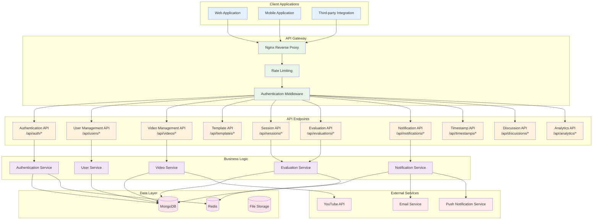
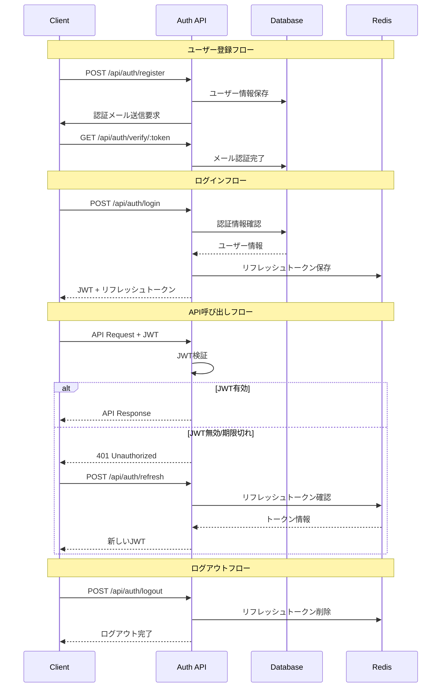

# API ドキュメント

## 概要

よさこいパフォーマンス評価システムのREST API仕様書です。

### API構造図



*図1: API アーキテクチャ構造*

## ベースURL

```text
本番環境: https://api.yosakoi-eval.com
開発環境: http://localhost:3001
```

## 認証

### JWT認証フロー



*図2: JWT認証フロー*

すべてのAPIエンドポイント（認証関連を除く）では、JWTトークンによる認証が必要です。

```http
Authorization: Bearer <jwt_token>
```

### トークンの取得

```http
POST /api/auth/login
Content-Type: application/json

{
  "email": "user@example.com",
  "password": "password"
}
```

## エラーレスポンス

### 標準エラー形式

```json
{
  "status": "error",
  "code": "ERROR_CODE",
  "message": "エラーメッセージ",
  "details": {
    "field": "エラーの詳細情報"
  },
  "requestId": "req-123-456-789"
}
```

### HTTPステータスコード

- `200` - 成功
- `201` - 作成成功
- `400` - リクエストエラー
- `401` - 認証エラー
- `403` - 権限エラー
- `404` - リソース未発見
- `429` - レート制限
- `500` - サーバーエラー

## 認証API

### ユーザー登録

```http
POST /api/auth/register
Content-Type: application/json

{
  "username": "testuser",
  "email": "user@example.com",
  "password": "securepassword"
}
```

**レスポンス:**

```json
{
  "status": "success",
  "data": {
    "user": {
      "id": "user_id",
      "username": "testuser",
      "email": "user@example.com",
      "role": "user",
      "createdAt": "2023-12-01T00:00:00.000Z"
    },
    "token": "jwt_token_here"
  }
}
```

### ログイン

```http
POST /api/auth/login
Content-Type: application/json

{
  "email": "user@example.com",
  "password": "password"
}
```

### ログアウト

```http
POST /api/auth/logout
Authorization: Bearer <jwt_token>
```

### トークン更新

```http
POST /api/auth/refresh
Authorization: Bearer <refresh_token>
```

## ユーザー管理API

### 現在のユーザー情報取得

```http
GET /api/users/me
Authorization: Bearer <jwt_token>
```

### ユーザー情報更新

```http
PUT /api/users/me
Authorization: Bearer <jwt_token>
Content-Type: application/json

{
  "username": "newusername",
  "profile": {
    "displayName": "表示名",
    "bio": "自己紹介"
  }
}
```

### パスワード変更

```http
PUT /api/users/me/password
Authorization: Bearer <jwt_token>
Content-Type: application/json

{
  "currentPassword": "current_password",
  "newPassword": "new_password"
}
```

## 動画管理API

### 動画一覧取得

```http
GET /api/videos?page=1&limit=10&search=keyword&category=dance
Authorization: Bearer <jwt_token>
```

**クエリパラメータ:**

- `page`: ページ番号（デフォルト: 1）
- `limit`: 1ページあたりの件数（デフォルト: 10、最大: 100）
- `search`: 検索キーワード
- `category`: カテゴリフィルター
- `sortBy`: ソート項目（createdAt, title, uploadDate）
- `sortOrder`: ソート順（asc, desc）

**レスポンス:**

```json
{
  "status": "success",
  "data": {
    "videos": [
      {
        "id": "video_id",
        "youtubeId": "youtube_video_id",
        "title": "動画タイトル",
        "channelName": "チャンネル名",
        "uploadDate": "2023-12-01T00:00:00.000Z",
        "metadata": {
          "teamName": "チーム名",
          "performanceName": "演舞名",
          "eventName": "大会名"
        },
        "thumbnailUrl": "https://img.youtube.com/vi/video_id/maxresdefault.jpg",
        "createdAt": "2023-12-01T00:00:00.000Z"
      }
    ],
    "pagination": {
      "currentPage": 1,
      "totalPages": 5,
      "totalItems": 50,
      "hasNext": true,
      "hasPrev": false
    }
  }
}
```

### 動画詳細取得
```http
GET /api/videos/:id
Authorization: Bearer <jwt_token>
```

### 動画登録
```http
POST /api/videos
Authorization: Bearer <jwt_token>
Content-Type: application/json

{
  "youtubeUrl": "https://www.youtube.com/watch?v=VIDEO_ID",
  "metadata": {
    "teamName": "チーム名",
    "performanceName": "演舞名",
    "eventName": "大会名",
    "year": 2023,
    "location": "開催地"
  },
  "tags": ["よさこい", "ソーラン", "2023"]
}
```

### 動画情報更新
```http
PUT /api/videos/:id
Authorization: Bearer <jwt_token>
Content-Type: application/json

{
  "metadata": {
    "teamName": "更新されたチーム名"
  },
  "tags": ["新しいタグ"]
}
```

### 動画削除
```http
DELETE /api/videos/:id
Authorization: Bearer <jwt_token>
```

## 評価テンプレートAPI

### テンプレート一覧取得
```http
GET /api/templates
Authorization: Bearer <jwt_token>
```

### テンプレート詳細取得
```http
GET /api/templates/:id
Authorization: Bearer <jwt_token>
```

### テンプレート作成
```http
POST /api/templates
Authorization: Bearer <jwt_token>
Content-Type: application/json

{
  "name": "テンプレート名",
  "description": "テンプレートの説明",
  "categories": [
    {
      "name": "技術面",
      "description": "技術的な評価項目",
      "weight": 0.4,
      "criteria": [
        {
          "name": "基本動作",
          "description": "基本的な動作の正確性",
          "type": "numeric",
          "minValue": 1,
          "maxValue": 10,
          "weight": 0.3
        }
      ]
    }
  ]
}
```

### テンプレート更新
```http
PUT /api/templates/:id
Authorization: Bearer <jwt_token>
```

### テンプレート削除
```http
DELETE /api/templates/:id
Authorization: Bearer <jwt_token>
```

## 評価セッションAPI

### セッション一覧取得
```http
GET /api/sessions?status=active&page=1&limit=10
Authorization: Bearer <jwt_token>
```

### セッション詳細取得
```http
GET /api/sessions/:id
Authorization: Bearer <jwt_token>
```

### セッション作成
```http
POST /api/sessions
Authorization: Bearer <jwt_token>
Content-Type: application/json

{
  "name": "セッション名",
  "description": "セッションの説明",
  "videoId": "video_id",
  "templateId": "template_id",
  "startDate": "2023-12-01T00:00:00.000Z",
  "endDate": "2023-12-07T23:59:59.000Z",
  "settings": {
    "isAnonymous": false,
    "showResultsAfterSubmit": true,
    "allowComments": true
  }
}
```

### 評価者招待
```http
POST /api/sessions/:id/invite
Authorization: Bearer <jwt_token>
Content-Type: application/json

{
  "emails": ["evaluator1@example.com", "evaluator2@example.com"],
  "role": "evaluator",
  "message": "評価セッションへの招待メッセージ"
}
```

### セッション更新
```http
PUT /api/sessions/:id
Authorization: Bearer <jwt_token>
```

### セッション削除
```http
DELETE /api/sessions/:id
Authorization: Bearer <jwt_token>
```

## 評価API

### 評価提出
```http
POST /api/evaluations
Authorization: Bearer <jwt_token>
Content-Type: application/json

{
  "sessionId": "session_id",
  "scores": [
    {
      "criterionId": "criterion_id",
      "score": 8,
      "comment": "評価コメント"
    }
  ],
  "comments": [
    {
      "timestamp": 120,
      "text": "この部分が良かった"
    }
  ]
}
```

### 評価取得
```http
GET /api/evaluations/:sessionId
Authorization: Bearer <jwt_token>
```

### コメント追加
```http
POST /api/evaluations/comments
Authorization: Bearer <jwt_token>
Content-Type: application/json

{
  "evaluationId": "evaluation_id",
  "timestamp": 180,
  "text": "追加コメント"
}
```

### コメント取得
```http
GET /api/evaluations/comments/:evaluationId
Authorization: Bearer <jwt_token>
```

## 通知API

### 通知一覧取得

```http
GET /api/notifications?page=1&limit=10&status=unread
Authorization: Bearer <jwt_token>
```

**クエリパラメータ:**

- `page`: ページ番号（デフォルト: 1）
- `limit`: 1ページあたりの件数（デフォルト: 10、最大: 50）
- `status`: 通知状態（all, read, unread）
- `type`: 通知タイプ（session_invite, evaluation_reminder, result_published）

**レスポンス:**

```json
{
  "status": "success",
  "data": {
    "notifications": [
      {
        "id": "notification_id",
        "type": "session_invite",
        "title": "評価セッションへの招待",
        "message": "新しい評価セッションに招待されました",
        "data": {
          "sessionId": "session_id",
          "sessionName": "セッション名"
        },
        "isRead": false,
        "createdAt": "2023-12-01T00:00:00.000Z"
      }
    ],
    "pagination": {
      "currentPage": 1,
      "totalPages": 3,
      "totalItems": 25,
      "hasNext": true,
      "hasPrev": false
    }
  }
}
```

### 通知詳細取得

```http
GET /api/notifications/:id
Authorization: Bearer <jwt_token>
```

### 通知削除

```http
DELETE /api/notifications/:id
Authorization: Bearer <jwt_token>
```

### 未読通知数取得

```http
GET /api/notifications/unread/count
Authorization: Bearer <jwt_token>
```

**レスポンス:**

```json
{
  "status": "success",
  "data": {
    "unreadCount": 5
  }
}
```

### 通知設定取得

```http
GET /api/notifications/settings
Authorization: Bearer <jwt_token>
```

### 通知設定更新

```http
PUT /api/notifications/settings
Authorization: Bearer <jwt_token>
Content-Type: application/json

{
  "emailNotifications": true,
  "pushNotifications": false,
  "notificationTypes": {
    "session_invite": true,
    "evaluation_reminder": true,
    "result_published": false
  }
}
```

## タイムスタンプAPI

### タイムスタンプリンク作成

```http
POST /api/timestamps
Authorization: Bearer <jwt_token>
Content-Type: application/json

{
  "videoId": "video_id",
  "timestamp": 120,
  "title": "注目ポイント",
  "description": "この部分の動きが素晴らしい",
  "isPublic": true,
  "expiresAt": "2024-12-01T00:00:00.000Z"
}
```

**レスポンス:**

```json
{
  "status": "success",
  "data": {
    "id": "timestamp_id",
    "token": "unique_token",
    "videoId": "video_id",
    "timestamp": 120,
    "title": "注目ポイント",
    "description": "この部分の動きが素晴らしい",
    "isPublic": true,
    "viewCount": 0,
    "shareUrl": "https://your-domain.com/share/unique_token",
    "createdAt": "2023-12-01T00:00:00.000Z"
  }
}
```

### タイムスタンプリンク一覧取得

```http
GET /api/timestamps?videoId=video_id&page=1&limit=10
Authorization: Bearer <jwt_token>
```

### タイムスタンプリンク詳細取得

```http
GET /api/timestamps/:token
```

**注意**: このエンドポイントは認証不要で、公開リンクとしてアクセス可能

### タイムスタンプリンク更新

```http
PUT /api/timestamps/:id
Authorization: Bearer <jwt_token>
Content-Type: application/json

{
  "title": "更新されたタイトル",
  "description": "更新された説明",
  "isPublic": false
}
```

### タイムスタンプリンク削除

```http
DELETE /api/timestamps/:id
Authorization: Bearer <jwt_token>
```

### 視聴回数増加

```http
POST /api/timestamps/:token/view
```

### 埋め込み用データ取得

```http
GET /api/timestamps/:token/embed
```

**レスポンス:**

```json
{
  "status": "success",
  "data": {
    "title": "注目ポイント",
    "description": "この部分の動きが素晴らしい",
    "timestamp": 120,
    "videoData": {
      "youtubeId": "youtube_video_id",
      "title": "動画タイトル",
      "thumbnailUrl": "https://img.youtube.com/vi/video_id/maxresdefault.jpg"
    },
    "embedCode": "<iframe src='...' width='560' height='315'></iframe>"
  }
}
```

## ディスカッションAPI

### ディスカッションスレッド作成

```http
POST /api/discussions/threads
Authorization: Bearer <jwt_token>
Content-Type: application/json

{
  "title": "この演舞について",
  "content": "技術面での議論をしましょう",
  "type": "evaluation",
  "shareId": "share_id",
  "evaluationId": "evaluation_id",
  "sessionId": "session_id"
}
```

**レスポンス:**

```json
{
  "status": "success",
  "data": {
    "id": "thread_id",
    "title": "この演舞について",
    "content": "技術面での議論をしましょう",
    "type": "evaluation",
    "author": {
      "id": "user_id",
      "username": "username",
      "displayName": "表示名"
    },
    "commentCount": 0,
    "createdAt": "2023-12-01T00:00:00.000Z"
  }
}
```

### ディスカッションスレッド一覧取得

```http
GET /api/discussions/threads?shareId=share_id&type=evaluation&page=1&limit=10
Authorization: Bearer <jwt_token>
```

### ディスカッションスレッド詳細取得

```http
GET /api/discussions/threads/:id
Authorization: Bearer <jwt_token>
```

### コメント作成

```http
POST /api/discussions/threads/:threadId/comments
Authorization: Bearer <jwt_token>
Content-Type: application/json

{
  "content": "同感です。特に中盤の構成が素晴らしい。",
  "parentId": "parent_comment_id"
}
```

### コメント一覧取得

```http
GET /api/discussions/threads/:threadId/comments?page=1&limit=20
Authorization: Bearer <jwt_token>
```

### コメント更新

```http
PUT /api/discussions/comments/:id
Authorization: Bearer <jwt_token>
Content-Type: application/json

{
  "content": "更新されたコメント内容"
}
```

## 分析API

### セッション分析
```http
GET /api/analytics/session/:sessionId
Authorization: Bearer <jwt_token>
```

**レスポンス:**
```json
{
  "status": "success",
  "data": {
    "summary": {
      "totalEvaluators": 5,
      "completedEvaluations": 4,
      "averageScore": 7.2,
      "standardDeviation": 1.5
    },
    "categoryScores": [
      {
        "categoryName": "技術面",
        "averageScore": 7.5,
        "scores": [8, 7, 8, 6, 9]
      }
    ],
    "criterionAnalysis": [
      {
        "criterionName": "基本動作",
        "averageScore": 7.8,
        "agreement": 0.85,
        "distribution": {
          "1-2": 0,
          "3-4": 1,
          "5-6": 1,
          "7-8": 2,
          "9-10": 1
        }
      }
    ]
  }
}
```

### セッション比較
```http
GET /api/analytics/compare?sessions=id1,id2,id3
Authorization: Bearer <jwt_token>
```

### データエクスポート
```http
GET /api/analytics/export/:sessionId?format=csv
Authorization: Bearer <jwt_token>
```

**サポートされる形式:**
- `csv` - CSV形式
- `json` - JSON形式
- `pdf` - PDFレポート

## WebSocket API

### 接続
```javascript
const socket = io('ws://localhost:3001', {
  auth: {
    token: 'jwt_token_here'
  }
});
```

### イベント

#### リアルタイム評価更新
```javascript
// 評価更新の受信
socket.on('evaluation:update', (data) => {
  console.log('評価が更新されました:', data);
});

// 評価更新の送信
socket.emit('evaluation:update', {
  sessionId: 'session_id',
  evaluationId: 'evaluation_id',
  scores: [...]
});
```

#### コメント通知
```javascript
// コメント追加の受信
socket.on('comment:add', (data) => {
  console.log('新しいコメント:', data);
});

// コメント追加の送信
socket.emit('comment:add', {
  evaluationId: 'evaluation_id',
  timestamp: 120,
  text: 'コメント内容'
});
```

#### セッションステータス
```javascript
// セッションステータス更新の受信
socket.on('session:status', (data) => {
  console.log('セッションステータス:', data);
});
```

## レート制限

### 制限値

- **ログイン**: 15分間に5回
- **登録**: 1時間に3回
- **一般API**: 15分間に100回
- **アップロード**: 1時間に10回

### レスポンスヘッダー

```http
X-RateLimit-Limit: 100
X-RateLimit-Remaining: 95
X-RateLimit-Reset: 1640995200
```

## ページネーション

### リクエスト

```http
GET /api/videos?page=2&limit=20
```

### レスポンス

```json
{
  "data": [...],
  "pagination": {
    "currentPage": 2,
    "totalPages": 10,
    "totalItems": 200,
    "hasNext": true,
    "hasPrev": true,
    "nextPage": 3,
    "prevPage": 1
  }
}
```

## フィルタリング・ソート

### フィルタリング

```http
GET /api/videos?category=dance&year=2023&teamName=チーム名
```

### ソート

```http
GET /api/videos?sortBy=createdAt&sortOrder=desc
```

### 検索

```http
GET /api/videos?search=よさこい&searchFields=title,metadata.teamName
```

## バージョニング

APIのバージョンはURLパスで指定します：

```text
/api/v1/videos  # バージョン1
/api/v2/videos  # バージョン2（将来）
```

現在のバージョン: `v1`

## SDK・ライブラリ

### JavaScript/TypeScript

```bash
npm install @yosakoi-eval/api-client
```

```javascript
import { YosakoiApiClient } from '@yosakoi-eval/api-client';

const client = new YosakoiApiClient({
  baseUrl: 'https://api.yosakoi-eval.com',
  token: 'your_jwt_token'
});

const videos = await client.videos.list();
```

## 開発者向け情報

### 開発環境セットアップ

```bash
git clone https://github.com/your-org/yosakoi-evaluation
cd yosakoi-evaluation
npm run install:all
npm run dev
```

### テスト

```bash
npm run test:backend
```

### API仕様書の更新

API仕様書はOpenAPI 3.0形式でも提供されています：

- [OpenAPI仕様書](./openapi.yaml)
- [Swagger UI](http://localhost:3001/api-docs)

## サポート

- **ドキュメント**: <https://docs.yosakoi-eval.com>
- **GitHub Issues**: <https://github.com/your-org/yosakoi-evaluation/issues>
- **メール**: <api-support@yosakoi-eval.com>