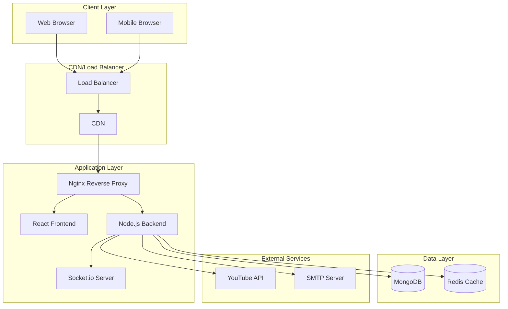
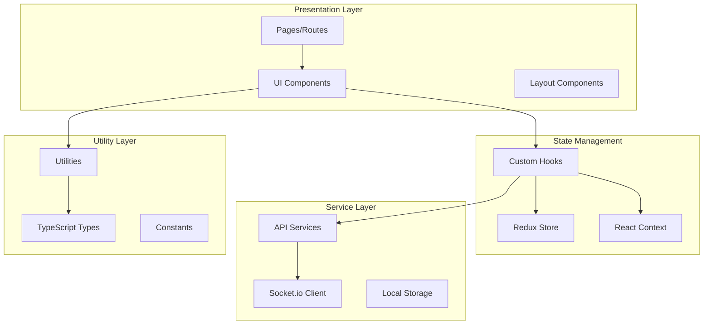
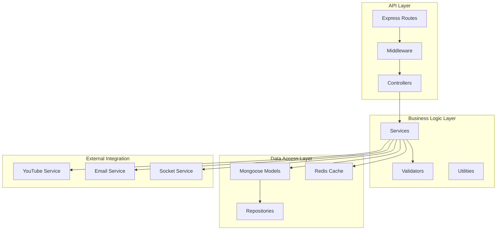
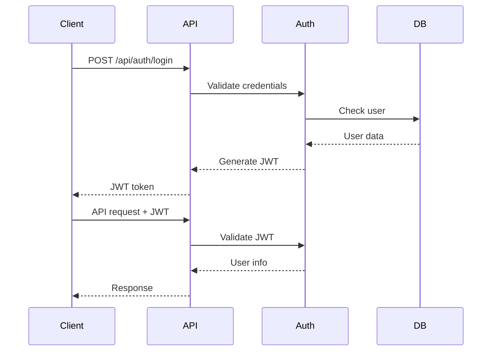
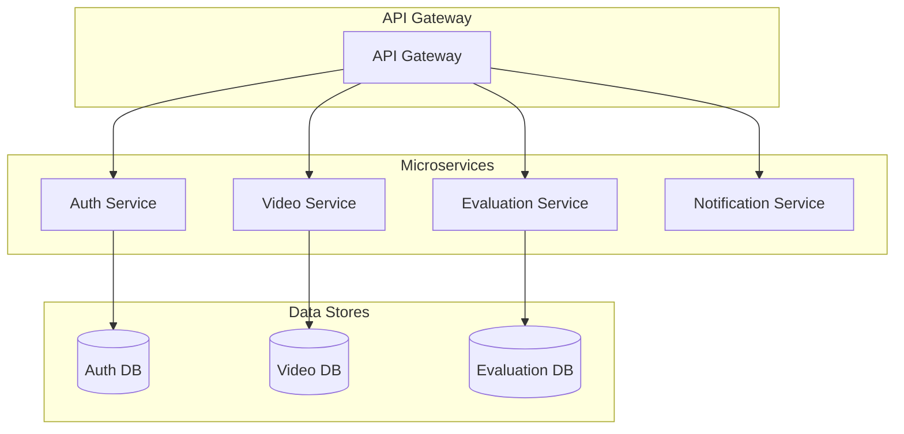

# システムアーキテクチャ

## 概要

YOSAKOIパフォーマンス評価システムは、YouTube動画を活用したよさこいソーラン演舞の評価・分析プラットフォームです。本ドキュメントでは、システム全体のアーキテクチャ、データベース設計、API設計、セキュリティアーキテクチャについて詳述します。

## システム全体アーキテクチャ

### 高レベルアーキテクチャ図



### アーキテクチャの特徴

#### 1. マイクロサービス指向
- **フロントエンド**: React SPA（Single Page Application）
- **バックエンド**: Node.js REST API + Socket.io
- **データベース**: MongoDB（メイン）+ Redis（キャッシュ・セッション）

#### 2. スケーラビリティ
- **水平スケーリング**: Docker Composeによるコンテナ化
- **キャッシュ戦略**: Redis による API レスポンスキャッシュ
- **CDN活用**: 静的ファイルの配信最適化

#### 3. リアルタイム性
- **WebSocket通信**: Socket.io による双方向通信
- **リアルタイム評価**: 評価進捗のリアルタイム更新
- **通知システム**: 即座の通知配信

## コンポーネントアーキテクチャ

### フロントエンド アーキテクチャ



#### 主要コンポーネント

**1. 認証システム**
```typescript
// AuthContext による認証状態管理
interface AuthContextType {
  user: User | null;
  isAuthenticated: boolean;
  login: (email: string, password: string) => Promise<void>;
  logout: () => void;
  hasRole: (role: UserRole) => boolean;
}
```

**2. 状態管理**
```typescript
// Redux Toolkit による状態管理
interface RootState {
  auth: AuthState;
  videos: VideosState;
  sessions: SessionsState;
  templates: TemplatesState;
  evaluations: EvaluationsState;
}
```

**3. ルーティング**
```typescript
// React Router による SPA ルーティング
const routes = [
  { path: '/dashboard', component: Dashboard, protected: true },
  { path: '/videos', component: VideoManagement, protected: true },
  { path: '/sessions', component: SessionList, roles: ['admin', 'evaluator'] },
  { path: '/evaluations', component: EvaluationPage, protected: true }
];
```

### バックエンド アーキテクチャ



#### レイヤー別責務

**1. API Layer**
- **Routes**: エンドポイント定義とルーティング
- **Middleware**: 認証、バリデーション、ログ出力
- **Controllers**: リクエスト/レスポンス処理

**2. Business Logic Layer**
- **Services**: ビジネスロジックの実装
- **Validators**: 入力データの検証
- **Utils**: 共通ユーティリティ関数

**3. Data Access Layer**
- **Models**: データモデル定義（Mongoose）
- **Repositories**: データアクセス抽象化
- **Cache**: キャッシュ管理（Redis）

## データベース設計

### MongoDB スキーマ設計

#### 1. Users Collection

```typescript
interface User {
  _id: ObjectId;
  username: string;
  email: string;
  passwordHash: string;
  role: 'admin' | 'evaluator' | 'user';
  profile: {
    displayName?: string;
    bio?: string;
    avatar?: string;
  };
  isActive: boolean;
  emailVerified: boolean;
  lastLoginAt?: Date;
  createdAt: Date;
  updatedAt: Date;
}

// インデックス
db.users.createIndex({ email: 1 }, { unique: true });
db.users.createIndex({ username: 1 }, { unique: true });
db.users.createIndex({ role: 1 });
db.users.createIndex({ isActive: 1 });
```

#### 2. Videos Collection

```typescript
interface Video {
  _id: ObjectId;
  youtubeId: string;
  title: string;
  channelName: string;
  uploadDate: Date;
  thumbnailUrl: string;
  metadata: {
    teamName: string;
    performanceName?: string;
    eventName?: string;
    year?: number;
    location?: string;
  };
  tags: string[];
  uploadedBy: ObjectId; // User._id
  isDeleted: boolean;
  createdAt: Date;
  updatedAt: Date;
}

// インデックス
db.videos.createIndex({ youtubeId: 1 }, { unique: true });
db.videos.createIndex({ "metadata.teamName": 1 });
db.videos.createIndex({ "metadata.year": 1 });
db.videos.createIndex({ uploadedBy: 1 });
db.videos.createIndex({ createdAt: -1 });
db.videos.createIndex({ 
  title: "text", 
  "metadata.teamName": "text", 
  "metadata.eventName": "text" 
});
```

#### 3. Templates Collection

```typescript
interface Template {
  _id: ObjectId;
  name: string;
  description?: string;
  categories: {
    name: string;
    description?: string;
    weight: number;
    criteria: {
      name: string;
      description?: string;
      type: 'numeric' | 'scale' | 'boolean';
      minValue?: number;
      maxValue?: number;
      weight: number;
    }[];
  }[];
  createdBy: ObjectId; // User._id
  isPublic: boolean;
  usageCount: number;
  createdAt: Date;
  updatedAt: Date;
}

// インデックス
db.templates.createIndex({ createdBy: 1 });
db.templates.createIndex({ isPublic: 1 });
db.templates.createIndex({ usageCount: -1 });
```

#### 4. Sessions Collection

```typescript
interface Session {
  _id: ObjectId;
  name: string;
  description?: string;
  videoId: ObjectId; // Video._id
  templateId: ObjectId; // Template._id
  createdBy: ObjectId; // User._id
  participants: {
    userId: ObjectId;
    role: 'evaluator' | 'observer';
    invitedAt: Date;
    joinedAt?: Date;
    status: 'invited' | 'joined' | 'completed';
  }[];
  settings: {
    isAnonymous: boolean;
    showResultsAfterSubmit: boolean;
    allowComments: boolean;
    autoReminder: boolean;
  };
  status: 'draft' | 'active' | 'closed';
  startDate: Date;
  endDate: Date;
  createdAt: Date;
  updatedAt: Date;
}

// インデックス
db.sessions.createIndex({ createdBy: 1 });
db.sessions.createIndex({ videoId: 1 });
db.sessions.createIndex({ templateId: 1 });
db.sessions.createIndex({ status: 1 });
db.sessions.createIndex({ startDate: 1, endDate: 1 });
db.sessions.createIndex({ "participants.userId": 1 });
```

#### 5. Evaluations Collection

```typescript
interface Evaluation {
  _id: ObjectId;
  sessionId: ObjectId; // Session._id
  evaluatorId: ObjectId; // User._id
  scores: {
    categoryId: string;
    criterionId: string;
    score: number;
    comment?: string;
  }[];
  comments: {
    timestamp: number; // 動画の秒数
    text: string;
    category?: string;
    createdAt: Date;
  }[];
  totalScore: number;
  isSubmitted: boolean;
  submittedAt?: Date;
  createdAt: Date;
  updatedAt: Date;
}

// インデックス
db.evaluations.createIndex({ sessionId: 1, evaluatorId: 1 }, { unique: true });
db.evaluations.createIndex({ sessionId: 1 });
db.evaluations.createIndex({ evaluatorId: 1 });
db.evaluations.createIndex({ isSubmitted: 1 });
```

### Redis データ構造

#### 1. セッション管理

```redis
# ユーザーセッション
session:user:{userId} = {
  token: "jwt_token",
  refreshToken: "refresh_token",
  expiresAt: timestamp
}

# アクティブセッション
active_sessions = Set[user_id1, user_id2, ...]
```

#### 2. キャッシュ

```redis
# API レスポンスキャッシュ
cache:videos:list:{query_hash} = {
  data: json_data,
  expiresAt: timestamp
}

# ユーザー情報キャッシュ
cache:user:{userId} = {
  user_data: json_data,
  expiresAt: timestamp
}
```

#### 3. リアルタイム通信

```redis
# Socket.io セッション
socket:session:{socketId} = {
  userId: user_id,
  sessionId: evaluation_session_id,
  connectedAt: timestamp
}

# 評価セッション参加者
session:participants:{sessionId} = Set[user_id1, user_id2, ...]
```

## API設計

### RESTful API 設計原則

#### 1. リソース指向設計

```
GET    /api/videos              # 動画一覧取得
POST   /api/videos              # 動画作成
GET    /api/videos/{id}         # 動画詳細取得
PUT    /api/videos/{id}         # 動画更新
DELETE /api/videos/{id}         # 動画削除

GET    /api/sessions            # セッション一覧取得
POST   /api/sessions            # セッション作成
GET    /api/sessions/{id}       # セッション詳細取得
PUT    /api/sessions/{id}       # セッション更新
DELETE /api/sessions/{id}       # セッション削除
```

#### 2. 統一レスポンス形式

```typescript
// 成功レスポンス
interface SuccessResponse<T> {
  status: 'success';
  data: T;
  meta?: {
    pagination?: PaginationInfo;
    timestamp: string;
  };
}

// エラーレスポンス
interface ErrorResponse {
  status: 'error';
  code: string;
  message: string;
  details?: Record<string, any>;
  requestId: string;
}
```

#### 3. バージョニング戦略

```
/api/v1/videos    # 現在のバージョン
/api/v2/videos    # 将来のバージョン
```

### WebSocket API 設計

#### 1. 名前空間設計

```typescript
// 評価セッション用名前空間
const evaluationNamespace = io.of('/evaluation');

// イベント定義
interface EvaluationEvents {
  // クライアント → サーバー
  'join-session': (sessionId: string) => void;
  'leave-session': (sessionId: string) => void;
  'update-score': (data: ScoreUpdateData) => void;
  'add-comment': (data: CommentData) => void;

  // サーバー → クライアント
  'session-joined': (data: SessionJoinData) => void;
  'score-updated': (data: ScoreUpdateData) => void;
  'comment-added': (data: CommentData) => void;
  'participant-joined': (data: ParticipantData) => void;
  'participant-left': (data: ParticipantData) => void;
}
```

#### 2. リアルタイム機能

```typescript
// 評価進捗のリアルタイム更新
evaluationNamespace.on('connection', (socket) => {
  socket.on('join-session', async (sessionId) => {
    await socket.join(`session:${sessionId}`);
    
    // 参加者に通知
    socket.to(`session:${sessionId}`).emit('participant-joined', {
      userId: socket.userId,
      username: socket.username
    });
  });

  socket.on('update-score', async (data) => {
    // データベース更新
    await updateEvaluationScore(data);
    
    // 他の参加者に通知
    socket.to(`session:${data.sessionId}`).emit('score-updated', data);
  });
});
```

## セキュリティアーキテクチャ

### 認証・認可システム

#### 1. JWT ベース認証



#### 2. ロールベースアクセス制御（RBAC）

```typescript
enum UserRole {
  ADMIN = 'admin',
  EVALUATOR = 'evaluator', 
  USER = 'user'
}

const permissions = {
  [UserRole.ADMIN]: [
    'users:read', 'users:write', 'users:delete',
    'videos:read', 'videos:write', 'videos:delete',
    'sessions:read', 'sessions:write', 'sessions:delete',
    'templates:read', 'templates:write', 'templates:delete'
  ],
  [UserRole.EVALUATOR]: [
    'videos:read',
    'sessions:read', 'sessions:write',
    'templates:read', 'templates:write',
    'evaluations:read', 'evaluations:write'
  ],
  [UserRole.USER]: [
    'videos:read',
    'evaluations:read'
  ]
};
```

### データ保護

#### 1. 暗号化

```typescript
// パスワードハッシュ化
import bcrypt from 'bcrypt';

const hashPassword = async (password: string): Promise<string> => {
  const saltRounds = 12;
  return bcrypt.hash(password, saltRounds);
};

// 機密データ暗号化
import crypto from 'crypto';

const encrypt = (text: string, key: string): string => {
  const cipher = crypto.createCipher('aes-256-cbc', key);
  let encrypted = cipher.update(text, 'utf8', 'hex');
  encrypted += cipher.final('hex');
  return encrypted;
};
```

#### 2. 入力検証・サニタイゼーション

```typescript
import { body, validationResult } from 'express-validator';
import mongoSanitize from 'express-mongo-sanitize';
import xss from 'xss-clean';

// バリデーションルール
export const validateVideoInput = [
  body('youtubeUrl')
    .isURL()
    .matches(/^https:\/\/(www\.)?(youtube\.com\/watch\?v=|youtu\.be\/)/)
    .withMessage('Valid YouTube URL required'),
  body('metadata.teamName')
    .trim()
    .escape()
    .isLength({ min: 1, max: 100 })
    .withMessage('Team name is required')
];

// サニタイゼーション
app.use(mongoSanitize()); // NoSQL injection 対策
app.use(xss()); // XSS 対策
```

### ネットワークセキュリティ

#### 1. HTTPS/TLS

```nginx
# nginx.conf
server {
    listen 443 ssl http2;
    ssl_certificate /etc/ssl/certs/cert.pem;
    ssl_certificate_key /etc/ssl/private/key.pem;
    
    ssl_protocols TLSv1.2 TLSv1.3;
    ssl_ciphers ECDHE-RSA-AES256-GCM-SHA512:DHE-RSA-AES256-GCM-SHA512;
    ssl_prefer_server_ciphers off;
    
    add_header Strict-Transport-Security "max-age=63072000" always;
}
```

#### 2. セキュリティヘッダー

```typescript
import helmet from 'helmet';

app.use(helmet({
  contentSecurityPolicy: {
    directives: {
      defaultSrc: ["'self'"],
      scriptSrc: ["'self'", "'unsafe-inline'", "https://www.youtube.com"],
      styleSrc: ["'self'", "'unsafe-inline'", "https://fonts.googleapis.com"],
      imgSrc: ["'self'", "data:", "https://img.youtube.com"],
      connectSrc: ["'self'", "wss:", "https://www.googleapis.com"],
      frameSrc: ["https://www.youtube.com"]
    }
  },
  hsts: {
    maxAge: 31536000,
    includeSubDomains: true,
    preload: true
  }
}));
```

## パフォーマンス最適化

### フロントエンド最適化

#### 1. コード分割

```typescript
// 遅延読み込み
const ResultsPage = React.lazy(() => import('./components/results/ResultsPage'));
const AnalyticsPage = React.lazy(() => import('./components/analytics/AnalyticsPage'));

// ルート分割
const routes = [
  {
    path: '/results',
    component: React.lazy(() => import('./pages/ResultsPage'))
  }
];
```

#### 2. メモ化戦略

```typescript
// コンポーネントメモ化
const VideoCard = React.memo<VideoCardProps>(({ video, onEdit, onDelete }) => {
  const handleEdit = useCallback(() => onEdit(video), [video, onEdit]);
  const handleDelete = useCallback(() => onDelete(video.id), [video.id, onDelete]);
  
  return (
    <Card>
      {/* JSX */}
    </Card>
  );
});

// セレクターメモ化
const selectFilteredVideos = createSelector(
  [selectVideos, selectSearchTerm],
  (videos, searchTerm) => 
    videos.filter(video => 
      video.title.toLowerCase().includes(searchTerm.toLowerCase())
    )
);
```

### バックエンド最適化

#### 1. データベース最適化

```typescript
// インデックス戦略
const videoSchema = new Schema({
  // 複合インデックス
  metadata: {
    teamName: { type: String, index: true },
    year: { type: Number, index: true }
  }
});

// 複合インデックス
videoSchema.index({ 'metadata.teamName': 1, createdAt: -1 });

// テキスト検索インデックス
videoSchema.index({
  title: 'text',
  'metadata.teamName': 'text'
});
```

#### 2. キャッシュ戦略

```typescript
// Redis キャッシュ実装
class CacheService {
  private redis: Redis;

  async get<T>(key: string): Promise<T | null> {
    const cached = await this.redis.get(key);
    return cached ? JSON.parse(cached) : null;
  }

  async set(key: string, value: any, ttl: number = 300): Promise<void> {
    await this.redis.setex(key, ttl, JSON.stringify(value));
  }

  async invalidate(pattern: string): Promise<void> {
    const keys = await this.redis.keys(pattern);
    if (keys.length > 0) {
      await this.redis.del(...keys);
    }
  }
}

// 使用例
const getVideosWithCache = async (query: any) => {
  const cacheKey = `videos:${JSON.stringify(query)}`;
  
  let videos = await cacheService.get(cacheKey);
  if (!videos) {
    videos = await Video.find(query);
    await cacheService.set(cacheKey, videos, 300); // 5分間キャッシュ
  }
  
  return videos;
};
```

## 監視・ログ

### アプリケーション監視

#### 1. メトリクス収集

```typescript
// Prometheus メトリクス
import client from 'prom-client';

const httpRequestDuration = new client.Histogram({
  name: 'http_request_duration_seconds',
  help: 'Duration of HTTP requests in seconds',
  labelNames: ['method', 'route', 'status_code']
});

const activeUsers = new client.Gauge({
  name: 'active_users_total',
  help: 'Number of active users'
});

// ミドルウェア
const metricsMiddleware = (req: Request, res: Response, next: NextFunction) => {
  const start = Date.now();
  
  res.on('finish', () => {
    const duration = (Date.now() - start) / 1000;
    httpRequestDuration
      .labels(req.method, req.route?.path || req.path, res.statusCode.toString())
      .observe(duration);
  });
  
  next();
};
```

#### 2. ログ管理

```typescript
// 構造化ログ
import winston from 'winston';

const logger = winston.createLogger({
  level: process.env.LOG_LEVEL || 'info',
  format: winston.format.combine(
    winston.format.timestamp(),
    winston.format.errors({ stack: true }),
    winston.format.json()
  ),
  defaultMeta: { service: 'yosakoi-evaluation' },
  transports: [
    new winston.transports.File({ 
      filename: 'logs/error.log', 
      level: 'error' 
    }),
    new winston.transports.File({ 
      filename: 'logs/combined.log' 
    })
  ]
});

// 使用例
logger.info('User login attempt', {
  userId: user.id,
  email: user.email,
  ip: req.ip,
  userAgent: req.get('User-Agent')
});
```

## デプロイメント アーキテクチャ

### コンテナ化戦略

```yaml
# docker-compose.prod.yml
version: '3.8'
services:
  nginx:
    image: nginx:alpine
    ports:
      - "80:80"
      - "443:443"
    volumes:
      - ./nginx/nginx.conf:/etc/nginx/nginx.conf
      - ./nginx/ssl:/etc/ssl
    depends_on:
      - frontend
      - backend

  frontend:
    build:
      context: ./frontend
      dockerfile: Dockerfile.prod
    environment:
      - REACT_APP_API_BASE_URL=https://api.yourdomain.com

  backend:
    build:
      context: ./backend
      dockerfile: Dockerfile.prod
    environment:
      - NODE_ENV=production
      - MONGODB_URI=mongodb://mongodb:27017/yosakoi_evaluation
      - REDIS_URL=redis://redis:6379
    depends_on:
      - mongodb
      - redis

  mongodb:
    image: mongo:6.0
    volumes:
      - mongodb_data:/data/db
    environment:
      - MONGO_INITDB_ROOT_USERNAME=admin
      - MONGO_INITDB_ROOT_PASSWORD=${MONGO_ROOT_PASSWORD}

  redis:
    image: redis:7-alpine
    volumes:
      - redis_data:/data

volumes:
  mongodb_data:
  redis_data:
```

### CI/CD パイプライン

```yaml
# .github/workflows/deploy.yml
name: Deploy to Production

on:
  push:
    branches: [main]

jobs:
  test:
    runs-on: ubuntu-latest
    steps:
      - uses: actions/checkout@v3
      - uses: actions/setup-node@v3
        with:
          node-version: '18'
      - run: npm run install:all
      - run: npm run test
      - run: npm run lint

  build:
    needs: test
    runs-on: ubuntu-latest
    steps:
      - uses: actions/checkout@v3
      - run: docker build -t yosakoi-evaluation .
      - run: docker push ${{ secrets.DOCKER_REGISTRY }}/yosakoi-evaluation

  deploy:
    needs: build
    runs-on: ubuntu-latest
    steps:
      - name: Deploy to production
        run: |
          ssh ${{ secrets.PRODUCTION_SERVER }} '
            docker-compose -f docker-compose.prod.yml pull
            docker-compose -f docker-compose.prod.yml up -d
          '
```

## 技術的制約と考慮事項

### 制約事項

1. **YouTube API制限**
   - 1日あたりのクォータ制限
   - レート制限（100リクエスト/100秒/ユーザー）

2. **ブラウザ制限**
   - CORS制限
   - ローカルストレージ容量制限
   - WebSocket接続数制限

3. **データベース制限**
   - MongoDB ドキュメントサイズ制限（16MB）
   - インデックス数制限
   - 接続数制限

### 将来の拡張計画

#### 1. マイクロサービス化



#### 2. 機械学習統合

```typescript
// 評価予測サービス
interface MLPredictionService {
  predictScore(videoFeatures: VideoFeatures): Promise<PredictedScore>;
  analyzePerformance(evaluationData: EvaluationData): Promise<PerformanceInsights>;
  detectAnomalies(scores: Score[]): Promise<AnomalyReport>;
}
```

#### 3. リアルタイム分析

```typescript
// ストリーミング分析
interface StreamAnalytics {
  processEvaluationStream(stream: EvaluationStream): void;
  generateRealTimeInsights(): Promise<Insights>;
  detectTrends(timeWindow: TimeWindow): Promise<Trends>;
}
```

## まとめ

YOSAKOIパフォーマンス評価システムは、モダンなWebアーキテクチャパターンを採用し、スケーラビリティ、セキュリティ、パフォーマンスを重視した設計となっています。

### 主要な設計原則

1. **分離された関心事**: フロントエンド、バックエンド、データベースの明確な分離
2. **スケーラビリティ**: 水平スケーリングに対応したアーキテクチャ
3. **セキュリティファースト**: 多層防御によるセキュリティ対策
4. **パフォーマンス最適化**: キャッシュ戦略とデータベース最適化
5. **監視可能性**: 包括的なログ出力とメトリクス収集

このアーキテクチャにより、安定性と拡張性を両立したシステムの構築が可能となっています。