# 開発者ガイド

## 概要

よさこいパフォーマンス評価システムの開発者向けドキュメントです。プロジェクトの構造、開発環境のセットアップ、コーディング規約、開発プロセスについて説明します。

## 技術スタック

### フロントエンド

- **React 19.1.0**: UIライブラリ
- **TypeScript 4.9.5**: 型安全な開発
- **MUI 5.15.3**: UIコンポーネントライブラリ
- **Redux Toolkit 2.0.1**: 状態管理
- **React Router 6.20.1**: ルーティング
- **React Hook Form 7.48.2**: フォーム管理
- **Chart.js 4.4.1 & Recharts 2.15.4**: データ可視化
- **Socket.io Client 4.7.4**: リアルタイム通信
- **React YouTube 10.1.0**: YouTube動画埋め込み

### バックエンド

- **Node.js**: サーバーサイドランタイム
- **Express 4.18.2**: Webフレームワーク
- **TypeScript 5.3.3**: 型安全な開発
- **MongoDB**: メインデータベース（Mongoose 8.0.3）
- **Redis 4.6.11**: キャッシュ・セッション管理
- **Socket.io 4.7.4**: リアルタイム通信
- **JWT**: 認証・認可
- **bcrypt**: パスワードハッシュ化
- **Nodemailer 6.9.7**: メール送信
- **Google APIs 153.0.0**: YouTube API連携

### 開発・運用ツール

- **Docker & Docker Compose**: コンテナ化
- **Jest**: テストフレームワーク
- **ESLint**: コード品質チェック
- **Prettier**: コードフォーマット
- **Concurrently**: 並行プロセス実行

## プロジェクト構造

```
yosakoi-evaluation-system/
├── backend/                    # バックエンドアプリケーション
│   ├── src/
│   │   ├── controllers/        # APIコントローラー
│   │   ├── models/            # データモデル（Mongoose）
│   │   ├── routes/            # APIルート定義
│   │   ├── middleware/        # ミドルウェア
│   │   ├── services/          # ビジネスロジック
│   │   ├── utils/             # ユーティリティ関数
│   │   ├── types/             # TypeScript型定義
│   │   └── index.ts           # エントリーポイント
│   ├── tests/                 # テストファイル
│   ├── package.json
│   └── tsconfig.json
├── frontend/                   # フロントエンドアプリケーション
│   ├── public/                # 静的ファイル
│   ├── src/
│   │   ├── components/        # Reactコンポーネント
│   │   │   ├── auth/          # 認証関連
│   │   │   ├── common/        # 共通コンポーネント
│   │   │   ├── dashboard/     # ダッシュボード
│   │   │   ├── evaluation/    # 評価機能
│   │   │   ├── results/       # 結果表示
│   │   │   ├── session/       # セッション管理
│   │   │   ├── template/      # テンプレート管理
│   │   │   └── video/         # 動画管理
│   │   ├── contexts/          # React Context
│   │   ├── hooks/             # カスタムフック
│   │   ├── services/          # API通信
│   │   ├── store/             # Redux store
│   │   ├── types/             # TypeScript型定義
│   │   ├── utils/             # ユーティリティ関数
│   │   ├── App.tsx            # メインアプリケーション
│   │   └── index.tsx          # エントリーポイント
│   ├── package.json
│   └── tsconfig.json
├── docs/                       # ドキュメント
├── scripts/                    # 運用スクリプト
├── docker-compose.yml          # 開発環境用
├── docker-compose.prod.yml     # 本番環境用
├── package.json               # ルートパッケージ設定
└── README.md
```

## 開発環境セットアップ

### 前提条件

- Node.js 18.x以上
- npm 9.x以上
- Docker & Docker Compose
- Git

### 1. リポジトリのクローン

```bash
git clone https://github.com/your-org/yosakoi-evaluation-system.git
cd yosakoi-evaluation-system
```

### 2. 依存関係のインストール

```bash
# 全プロジェクトの依存関係を一括インストール
npm run install:all
```

### 3. 環境変数の設定

#### バックエンド環境変数

```bash
# backend/.env.development
NODE_ENV=development
PORT=3001
MONGODB_URI=mongodb://localhost:27017/yosakoi_evaluation_dev
REDIS_URL=redis://localhost:6379
JWT_SECRET=your_jwt_secret_key_here
JWT_EXPIRES_IN=1h
JWT_REFRESH_EXPIRES_IN=7d
YOUTUBE_API_KEY=your_youtube_api_key_here
SMTP_HOST=smtp.gmail.com
SMTP_PORT=587
SMTP_USER=your_email@gmail.com
SMTP_PASS=your_app_password
CORS_ORIGIN=http://localhost:3000
```

#### フロントエンド環境変数

```bash
# frontend/.env.development
REACT_APP_API_BASE_URL=http://localhost:3001
REACT_APP_SOCKET_URL=http://localhost:3001
REACT_APP_YOUTUBE_API_KEY=your_youtube_api_key_here
REACT_APP_LOG_LEVEL=debug
```

### 4. データベースのセットアップ

```bash
# Docker Composeでデータベースを起動
docker-compose up -d mongodb redis

# データベース接続確認
docker-compose exec mongodb mongo --eval "db.adminCommand('ping')"
docker-compose exec redis redis-cli ping
```

### 5. 開発サーバーの起動

```bash
# フロントエンドとバックエンドを同時起動
npm run dev

# または個別に起動
npm run dev:backend  # バックエンドのみ
npm run dev:frontend # フロントエンドのみ
```

### 6. 動作確認

- フロントエンド: <http://localhost:3000>
- バックエンドAPI: <http://localhost:3001>
- API Health Check: <http://localhost:3001/api/health>

## コーディング規約

### TypeScript

#### 基本ルール

- **厳密な型定義**: `any`の使用を避け、適切な型を定義する
- **インターフェース優先**: オブジェクトの型定義にはinterfaceを使用
- **Null安全**: Optional Chainingとnullish coalescingを活用
- **関数型**: 可能な限り純粋関数として実装

#### 命名規則

```typescript
// インターフェース: PascalCase
interface UserProfile {
  id: string;
  username: string;
  email: string;
}

// 型エイリアス: PascalCase
type ApiResponse<T> = {
  status: 'success' | 'error';
  data?: T;
  message?: string;
};

// 変数・関数: camelCase
const getUserProfile = async (userId: string): Promise<UserProfile> => {
  // 実装
};

// 定数: UPPER_SNAKE_CASE
const API_BASE_URL = 'http://localhost:3001';

// Enum: PascalCase
enum UserRole {
  ADMIN = 'admin',
  EVALUATOR = 'evaluator',
  USER = 'user'
}
```

### React

#### コンポーネント設計

```typescript
// 関数コンポーネント + TypeScript
interface VideoCardProps {
  video: Video;
  onEdit?: (video: Video) => void;
  onDelete?: (videoId: string) => void;
  className?: string;
}

const VideoCard: React.FC<VideoCardProps> = ({
  video,
  onEdit,
  onDelete,
  className
}) => {
  // カスタムフックの使用
  const { user } = useAuth();
  const [isLoading, setIsLoading] = useState(false);

  // イベントハンドラー
  const handleEdit = useCallback(() => {
    onEdit?.(video);
  }, [video, onEdit]);

  return (
    <Card className={className}>
      {/* JSX */}
    </Card>
  );
};

export default VideoCard;
```

#### フック使用ガイドライン

- **useState**: ローカル状態管理
- **useEffect**: 副作用処理（API呼び出し、イベントリスナー）
- **useCallback**: 関数のメモ化
- **useMemo**: 値のメモ化
- **useContext**: グローバル状態へのアクセス
- **カスタムフック**: ロジックの再利用

### CSS/スタイリング

#### Material-UI使用ガイドライン

```typescript
// sx propを使用したスタイリング
<Box
  sx={{
    display: 'flex',
    flexDirection: 'column',
    gap: 2,
    p: 3,
    borderRadius: 1,
    boxShadow: 1,
    // レスポンシブ対応
    '@media (max-width:600px)': {
      p: 2,
      gap: 1,
    },
  }}
>
  {/* コンテンツ */}
</Box>

// テーマの活用
const theme = useTheme();
<Typography
  variant="h4"
  sx={{
    color: theme.palette.primary.main,
    mb: theme.spacing(2),
  }}
>
  タイトル
</Typography>
```

### API設計

#### RESTful API

```typescript
// コントローラーの実装例
export const getVideos = async (req: Request, res: Response) => {
  try {
    const { page = 1, limit = 10, search } = req.query;
    
    const query: any = {};
    if (search) {
      query.$or = [
        { title: { $regex: search, $options: 'i' } },
        { 'metadata.teamName': { $regex: search, $options: 'i' } }
      ];
    }

    const videos = await Video.find(query)
      .limit(Number(limit))
      .skip((Number(page) - 1) * Number(limit))
      .sort({ createdAt: -1 });

    const total = await Video.countDocuments(query);

    res.json({
      status: 'success',
      data: {
        videos,
        pagination: {
          currentPage: Number(page),
          totalPages: Math.ceil(total / Number(limit)),
          totalItems: total,
          hasNext: Number(page) * Number(limit) < total,
          hasPrev: Number(page) > 1
        }
      }
    });
  } catch (error) {
    res.status(500).json({
      status: 'error',
      message: 'Failed to fetch videos',
      error: error.message
    });
  }
};
```

#### エラーハンドリング

```typescript
// カスタムエラークラス
export class AppError extends Error {
  public statusCode: number;
  public isOperational: boolean;

  constructor(message: string, statusCode: number) {
    super(message);
    this.statusCode = statusCode;
    this.isOperational = true;

    Error.captureStackTrace(this, this.constructor);
  }
}

// エラーハンドリングミドルウェア
export const errorHandler = (
  err: Error,
  req: Request,
  res: Response,
  next: NextFunction
) => {
  if (err instanceof AppError) {
    return res.status(err.statusCode).json({
      status: 'error',
      message: err.message
    });
  }

  // 予期しないエラー
  console.error('Unexpected error:', err);
  res.status(500).json({
    status: 'error',
    message: 'Internal server error'
  });
};
```

## Git ワークフロー

### 開発ワークフロー図

```mermaid
gitgraph
    commit id: "Initial"
    branch develop
    checkout develop
    commit id: "Setup"
    
    branch feature/user-auth
    checkout feature/user-auth
    commit id: "Auth API"
    commit id: "Auth UI"
    commit id: "Tests"
    
    checkout develop
    merge feature/user-auth
    commit id: "Merge auth"
    
    branch feature/video-mgmt
    checkout feature/video-mgmt
    commit id: "Video API"
    commit id: "Video UI"
    
    checkout develop
    branch hotfix/security-fix
    checkout hotfix/security-fix
    commit id: "Security patch"
    
    checkout main
    merge hotfix/security-fix
    commit id: "Hotfix v1.0.1"
    
    checkout develop
    merge hotfix/security-fix
    
    checkout feature/video-mgmt
    commit id: "Video tests"
    
    checkout develop
    merge feature/video-mgmt
    commit id: "Merge video"
    
    checkout main
    merge develop
    commit id: "Release v1.1.0"
```

*図1: Git ブランチ戦略とワークフロー*

### CI/CD パイプライン図

```mermaid
flowchart LR
    subgraph "Development"
        DEV_COMMIT[コミット] --> DEV_PUSH[プッシュ]
    end
    
    subgraph "CI Pipeline"
        DEV_PUSH --> LINT[リント]
        LINT --> UNIT_TEST[単体テスト]
        UNIT_TEST --> BUILD[ビルド]
        BUILD --> INTEGRATION_TEST[統合テスト]
    end
    
    subgraph "Quality Gates"
        INTEGRATION_TEST --> CODE_REVIEW[コードレビュー]
        CODE_REVIEW --> SECURITY_SCAN[セキュリティスキャン]
        SECURITY_SCAN --> MERGE_CHECK{マージ可能?}
    end
    
    subgraph "CD Pipeline"
        MERGE_CHECK -->|Yes| MERGE[マージ]
        MERGE --> STAGING_DEPLOY[ステージング<br/>デプロイ]
        STAGING_DEPLOY --> E2E_TEST[E2Eテスト]
        E2E_TEST --> PROD_DEPLOY[本番デプロイ]
    end
    
    subgraph "Monitoring"
        PROD_DEPLOY --> HEALTH_CHECK[ヘルスチェック]
        HEALTH_CHECK --> MONITORING[監視開始]
    end
    
    MERGE_CHECK -->|No| FIX[修正]
    FIX --> DEV_COMMIT
    
    classDef dev fill:#e3f2fd
    classDef ci fill:#e8f5e8
    classDef quality fill:#fff3e0
    classDef cd fill:#f3e5f5
    classDef monitor fill:#fce4ec

    class DEV_COMMIT,DEV_PUSH,FIX dev
    class LINT,UNIT_TEST,BUILD,INTEGRATION_TEST ci
    class CODE_REVIEW,SECURITY_SCAN,MERGE_CHECK quality
    class MERGE,STAGING_DEPLOY,E2E_TEST,PROD_DEPLOY cd
    class HEALTH_CHECK,MONITORING monitor
```



*図2: CI/CDパイプライン*

### ブランチ戦略

```
main                 # 本番環境用（安定版）
├── develop          # 開発統合ブランチ
├── feature/xxx      # 機能開発ブランチ
├── bugfix/xxx       # バグ修正ブランチ
└── hotfix/xxx       # 緊急修正ブランチ
```

### コミットメッセージ規約

```
<type>(<scope>): <subject>

<body>

<footer>
```

#### Type

- **feat**: 新機能
- **fix**: バグ修正
- **docs**: ドキュメント更新
- **style**: コードスタイル修正
- **refactor**: リファクタリング
- **test**: テスト追加・修正
- **chore**: その他の変更

#### 例

```
feat(video): add YouTube video registration functionality

- Add video registration form component
- Implement YouTube API integration
- Add video metadata extraction
- Update video list display

Closes #123
```

### プルリクエスト

#### テンプレート

```markdown
## 概要
この変更の概要を記述

## 変更内容
- [ ] 機能A の実装
- [ ] バグB の修正
- [ ] テストC の追加

## テスト
- [ ] 単体テスト実行済み
- [ ] 統合テスト実行済み
- [ ] 手動テスト実行済み

## スクリーンショット
（UI変更がある場合）

## 関連Issue
Closes #123
```

## 品質保証

### リンティング・フォーマット

```bash
# コード品質チェック
npm run lint

# 自動修正
npm run lint:fix

# フォーマット
npm run format
```

### 設定ファイル

#### ESLint設定（.eslintrc.js）

```javascript
module.exports = {
  extends: [
    '@typescript-eslint/recommended',
    'react-app',
    'react-app/jest',
    'prettier'
  ],
  rules: {
    '@typescript-eslint/no-unused-vars': 'error',
    '@typescript-eslint/explicit-function-return-type': 'warn',
    'react-hooks/exhaustive-deps': 'warn',
    'no-console': 'warn'
  }
};
```

#### Prettier設定（.prettierrc）

```json
{
  "semi": true,
  "trailingComma": "es5",
  "singleQuote": true,
  "printWidth": 80,
  "tabWidth": 2,
  "useTabs": false
}
```

## パフォーマンス最適化

### フロントエンド

#### コード分割

```typescript
// 遅延読み込み
const ResultsPage = React.lazy(() => import('./components/results/ResultsPage'));

// Suspenseでラップ
<React.Suspense fallback={<CircularProgress />}>
  <ResultsPage />
</React.Suspense>
```

#### メモ化

```typescript
// React.memo でコンポーネントをメモ化
const VideoCard = React.memo<VideoCardProps>(({ video, onEdit, onDelete }) => {
  // コンポーネント実装
});

// useMemo で値をメモ化
const filteredVideos = useMemo(() => {
  return videos.filter(video => 
    video.title.toLowerCase().includes(searchTerm.toLowerCase())
  );
}, [videos, searchTerm]);

// useCallback で関数をメモ化
const handleVideoEdit = useCallback((video: Video) => {
  setEditingVideo(video);
  setEditDialogOpen(true);
}, []);
```

### バックエンド

#### データベース最適化

```typescript
// インデックス設定
const videoSchema = new Schema({
  title: { type: String, required: true, index: true },
  youtubeId: { type: String, required: true, unique: true },
  'metadata.teamName': { type: String, index: true },
  createdAt: { type: Date, default: Date.now, index: true }
});

// 複合インデックス
videoSchema.index({ 'metadata.teamName': 1, createdAt: -1 });

// テキスト検索インデックス
videoSchema.index({
  title: 'text',
  'metadata.teamName': 'text',
  'metadata.eventName': 'text'
});
```

#### キャッシュ戦略

```typescript
// Redis キャッシュ
const getVideosWithCache = async (query: any) => {
  const cacheKey = `videos:${JSON.stringify(query)}`;
  
  // キャッシュから取得
  const cached = await redis.get(cacheKey);
  if (cached) {
    return JSON.parse(cached);
  }
  
  // データベースから取得
  const videos = await Video.find(query);
  
  // キャッシュに保存（5分間）
  await redis.setex(cacheKey, 300, JSON.stringify(videos));
  
  return videos;
};
```

## セキュリティ

### 認証・認可

```typescript
// JWT トークン検証ミドルウェア
export const authenticateToken = (req: Request, res: Response, next: NextFunction) => {
  const authHeader = req.headers['authorization'];
  const token = authHeader && authHeader.split(' ')[1];

  if (!token) {
    return res.status(401).json({ message: 'Access token required' });
  }

  jwt.verify(token, process.env.JWT_SECRET!, (err, user) => {
    if (err) {
      return res.status(403).json({ message: 'Invalid token' });
    }
    req.user = user;
    next();
  });
};

// ロールベース認可
export const requireRole = (roles: UserRole[]) => {
  return (req: Request, res: Response, next: NextFunction) => {
    if (!req.user || !roles.includes(req.user.role)) {
      return res.status(403).json({ message: 'Insufficient permissions' });
    }
    next();
  };
};
```

### 入力検証

```typescript
// express-validator を使用
export const validateVideoRegistration = [
  body('youtubeUrl')
    .isURL()
    .matches(/^https:\/\/(www\.)?(youtube\.com\/watch\?v=|youtu\.be\/)/)
    .withMessage('Valid YouTube URL required'),
  body('metadata.teamName')
    .trim()
    .isLength({ min: 1, max: 100 })
    .withMessage('Team name is required and must be less than 100 characters'),
  body('tags')
    .optional()
    .isArray()
    .withMessage('Tags must be an array'),
  
  // バリデーション結果チェック
  (req: Request, res: Response, next: NextFunction) => {
    const errors = validationResult(req);
    if (!errors.isEmpty()) {
      return res.status(400).json({
        status: 'error',
        message: 'Validation failed',
        errors: errors.array()
      });
    }
    next();
  }
];
```

## 貢献ガイドライン

### 開発プロセス

1. **Issue作成**: 機能要求やバグ報告をIssueで作成
2. **ブランチ作成**: `feature/issue-number-description` 形式
3. **開発**: コーディング規約に従って実装
4. **テスト**: 単体テスト・統合テストを実行
5. **プルリクエスト**: レビュー依頼
6. **コードレビュー**: 他の開発者によるレビュー
7. **マージ**: レビュー承認後にマージ

### コードレビューチェックリスト

- [ ] コーディング規約に準拠している
- [ ] 適切な型定義がされている
- [ ] エラーハンドリングが実装されている
- [ ] テストが追加・更新されている
- [ ] パフォーマンスに問題がない
- [ ] セキュリティ上の問題がない
- [ ] ドキュメントが更新されている

### 新機能開発の流れ

1. **要件定義**: 機能の詳細を明確化
2. **設計**: API設計、UI設計、データベース設計
3. **実装**: フロントエンド・バックエンドの実装
4. **テスト**: 単体テスト、統合テスト、E2Eテスト
5. **ドキュメント更新**: API仕様書、ユーザーマニュアル更新
6. **デプロイ**: ステージング環境での検証後、本番デプロイ

## テスト戦略

### テストピラミッド

```
    E2E Tests (少数)
   ┌─────────────────┐
   │   Integration   │ (中程度)
   │     Tests       │
   ├─────────────────┤
   │   Unit Tests    │ (多数)
   └─────────────────┘
```

### 単体テスト（Unit Tests）

#### フロントエンド - React Testing Library

```typescript
// components/__tests__/VideoCard.test.tsx
import { render, screen, fireEvent } from '@testing-library/react';
import { ThemeProvider } from '@mui/material/styles';
import { createTheme } from '@mui/material/styles';
import VideoCard from '../VideoCard';

const mockVideo = {
  id: '1',
  title: 'Test Video',
  youtubeId: 'test123',
  metadata: {
    teamName: 'Test Team',
    eventName: 'Test Event'
  },
  createdAt: new Date().toISOString()
};

const theme = createTheme();

const renderWithTheme = (component: React.ReactElement) => {
  return render(
    <ThemeProvider theme={theme}>
      {component}
    </ThemeProvider>
  );
};

describe('VideoCard', () => {
  it('renders video information correctly', () => {
    renderWithTheme(<VideoCard video={mockVideo} />);
    
    expect(screen.getByText('Test Video')).toBeInTheDocument();
    expect(screen.getByText('Test Team')).toBeInTheDocument();
    expect(screen.getByText('Test Event')).toBeInTheDocument();
  });

  it('calls onEdit when edit button is clicked', () => {
    const mockOnEdit = jest.fn();
    renderWithTheme(
      <VideoCard video={mockVideo} onEdit={mockOnEdit} />
    );
    
    const editButton = screen.getByLabelText('編集');
    fireEvent.click(editButton);
    
    expect(mockOnEdit).toHaveBeenCalledWith(mockVideo);
  });

  it('calls onDelete when delete button is clicked', () => {
    const mockOnDelete = jest.fn();
    renderWithTheme(
      <VideoCard video={mockVideo} onDelete={mockOnDelete} />
    );
    
    const deleteButton = screen.getByLabelText('削除');
    fireEvent.click(deleteButton);
    
    expect(mockOnDelete).toHaveBeenCalledWith(mockVideo.id);
  });
});
```

#### カスタムフックのテスト

```typescript
// hooks/__tests__/useAuth.test.ts
import { renderHook, act } from '@testing-library/react';
import { useAuth } from '../useAuth';

// モック
jest.mock('../services/authService', () => ({
  login: jest.fn(),
  logout: jest.fn(),
  getCurrentUser: jest.fn()
}));

describe('useAuth', () => {
  it('should initialize with no user', () => {
    const { result } = renderHook(() => useAuth());
    
    expect(result.current.user).toBeNull();
    expect(result.current.isAuthenticated).toBe(false);
    expect(result.current.isLoading).toBe(false);
  });

  it('should handle login successfully', async () => {
    const mockUser = { id: '1', username: 'testuser', role: 'user' };
    const mockLogin = require('../services/authService').login;
    mockLogin.mockResolvedValue({ user: mockUser, token: 'test-token' });

    const { result } = renderHook(() => useAuth());

    await act(async () => {
      await result.current.login('test@example.com', 'password');
    });

    expect(result.current.user).toEqual(mockUser);
    expect(result.current.isAuthenticated).toBe(true);
  });
});
```

#### バックエンド - Jest + Supertest

```typescript
// controllers/__tests__/videoController.test.ts
import request from 'supertest';
import app from '../../app';
import { Video } from '../../models/Video';
import { generateAuthToken } from '../../utils/auth';

// テスト用データベース設定
beforeAll(async () => {
  // テスト用MongoDB接続
});

afterAll(async () => {
  // データベース接続終了
});

beforeEach(async () => {
  // テストデータのクリーンアップ
  await Video.deleteMany({});
});

describe('GET /api/videos', () => {
  it('should return videos list', async () => {
    // テストデータ作成
    const testVideo = new Video({
      title: 'Test Video',
      youtubeId: 'test123',
      metadata: { teamName: 'Test Team' }
    });
    await testVideo.save();

    const token = generateAuthToken({ id: 'user1', role: 'user' });

    const response = await request(app)
      .get('/api/videos')
      .set('Authorization', `Bearer ${token}`)
      .expect(200);

    expect(response.body.status).toBe('success');
    expect(response.body.data.videos).toHaveLength(1);
    expect(response.body.data.videos[0].title).toBe('Test Video');
  });

  it('should return 401 without authentication', async () => {
    await request(app)
      .get('/api/videos')
      .expect(401);
  });
});

describe('POST /api/videos', () => {
  it('should create a new video', async () => {
    const token = generateAuthToken({ id: 'user1', role: 'user' });
    const videoData = {
      youtubeUrl: 'https://www.youtube.com/watch?v=test123',
      metadata: {
        teamName: 'Test Team',
        eventName: 'Test Event'
      }
    };

    const response = await request(app)
      .post('/api/videos')
      .set('Authorization', `Bearer ${token}`)
      .send(videoData)
      .expect(201);

    expect(response.body.status).toBe('success');
    expect(response.body.data.video.youtubeId).toBe('test123');
  });

  it('should validate required fields', async () => {
    const token = generateAuthToken({ id: 'user1', role: 'user' });

    const response = await request(app)
      .post('/api/videos')
      .set('Authorization', `Bearer ${token}`)
      .send({})
      .expect(400);

    expect(response.body.status).toBe('error');
    expect(response.body.message).toContain('Validation failed');
  });
});
```

### 統合テスト（Integration Tests）

#### API統合テスト

```typescript
// tests/integration/videoFlow.test.ts
import request from 'supertest';
import app from '../../src/app';

describe('Video Management Flow', () => {
  let authToken: string;
  let videoId: string;

  beforeAll(async () => {
    // テストユーザーでログイン
    const loginResponse = await request(app)
      .post('/api/auth/login')
      .send({
        email: 'test@example.com',
        password: 'testpassword'
      });
    
    authToken = loginResponse.body.data.token;
  });

  it('should complete full video management flow', async () => {
    // 1. 動画登録
    const createResponse = await request(app)
      .post('/api/videos')
      .set('Authorization', `Bearer ${authToken}`)
      .send({
        youtubeUrl: 'https://www.youtube.com/watch?v=test123',
        metadata: {
          teamName: 'Integration Test Team',
          eventName: 'Test Event'
        }
      })
      .expect(201);

    videoId = createResponse.body.data.video.id;

    // 2. 動画一覧取得
    const listResponse = await request(app)
      .get('/api/videos')
      .set('Authorization', `Bearer ${authToken}`)
      .expect(200);

    expect(listResponse.body.data.videos).toHaveLength(1);

    // 3. 動画詳細取得
    const detailResponse = await request(app)
      .get(`/api/videos/${videoId}`)
      .set('Authorization', `Bearer ${authToken}`)
      .expect(200);

    expect(detailResponse.body.data.video.metadata.teamName)
      .toBe('Integration Test Team');

    // 4. 動画更新
    await request(app)
      .put(`/api/videos/${videoId}`)
      .set('Authorization', `Bearer ${authToken}`)
      .send({
        metadata: {
          teamName: 'Updated Team Name'
        }
      })
      .expect(200);

    // 5. 更新確認
    const updatedResponse = await request(app)
      .get(`/api/videos/${videoId}`)
      .set('Authorization', `Bearer ${authToken}`)
      .expect(200);

    expect(updatedResponse.body.data.video.metadata.teamName)
      .toBe('Updated Team Name');

    // 6. 動画削除
    await request(app)
      .delete(`/api/videos/${videoId}`)
      .set('Authorization', `Bearer ${authToken}`)
      .expect(200);

    // 7. 削除確認
    await request(app)
      .get(`/api/videos/${videoId}`)
      .set('Authorization', `Bearer ${authToken}`)
      .expect(404);
  });
});
```

### E2Eテスト（End-to-End Tests）

#### Cypress設定

```typescript
// cypress/e2e/video-management.cy.ts
describe('Video Management', () => {
  beforeEach(() => {
    // ログイン
    cy.login('test@example.com', 'testpassword');
    cy.visit('/videos');
  });

  it('should register a new video', () => {
    // 新規動画登録ボタンをクリック
    cy.get('[data-testid="add-video-button"]').click();

    // YouTube URLを入力
    cy.get('[data-testid="youtube-url-input"]')
      .type('https://www.youtube.com/watch?v=test123');

    // 動画情報取得
    cy.get('[data-testid="fetch-video-info-button"]').click();

    // メタデータ入力
    cy.get('[data-testid="team-name-input"]').type('E2E Test Team');
    cy.get('[data-testid="event-name-input"]').type('E2E Test Event');

    // 登録実行
    cy.get('[data-testid="register-video-button"]').click();

    // 成功メッセージ確認
    cy.get('[data-testid="success-message"]')
      .should('contain', '動画が正常に登録されました');

    // 動画一覧に表示されることを確認
    cy.get('[data-testid="video-card"]')
      .should('contain', 'E2E Test Team');
  });

  it('should edit video metadata', () => {
    // 既存の動画カードの編集ボタンをクリック
    cy.get('[data-testid="video-card"]').first()
      .find('[data-testid="edit-button"]').click();

    // チーム名を変更
    cy.get('[data-testid="team-name-input"]')
      .clear()
      .type('Updated Team Name');

    // 更新実行
    cy.get('[data-testid="update-video-button"]').click();

    // 更新確認
    cy.get('[data-testid="video-card"]')
      .should('contain', 'Updated Team Name');
  });
});
```

### テスト実行

#### 単体テスト

```bash
# 全テスト実行
npm run test

# ウォッチモード
npm run test:watch

# カバレッジ付き実行
npm run test:coverage

# 特定ファイルのテスト
npm run test VideoCard.test.tsx

# バックエンドテスト
npm run test:backend

# フロントエンドテスト
npm run test:frontend
```

#### 統合・E2Eテスト

```bash
# 統合テスト
npm run test:integration

# E2Eテスト（Cypress）
npm run test:e2e

# E2Eテスト（ヘッドレス）
npm run test:e2e:headless
```

## デバッグ手順

### フロントエンド デバッグ

#### React Developer Tools

```typescript
// デバッグ用のカスタムフック
const useDebugValue = (value: any, label: string) => {
  React.useDebugValue(value, (val) => `${label}: ${JSON.stringify(val)}`);
  return value;
};

// 使用例
const MyComponent = () => {
  const [state, setState] = useState(initialState);
  useDebugValue(state, 'Component State');
  
  return <div>{/* JSX */}</div>;
};
```

#### Console デバッグ

```typescript
// 条件付きログ出力
const debug = (message: string, data?: any) => {
  if (process.env.NODE_ENV === 'development') {
    console.log(`[DEBUG] ${message}`, data);
  }
};

// パフォーマンス測定
const measurePerformance = (label: string, fn: () => void) => {
  console.time(label);
  fn();
  console.timeEnd(label);
};

// 使用例
const handleVideoLoad = useCallback(() => {
  debug('Video loading started');
  
  measurePerformance('Video Load Time', () => {
    // 動画読み込み処理
  });
}, []);
```

#### Redux DevTools

```typescript
// store/index.ts
import { configureStore } from '@reduxjs/toolkit';

export const store = configureStore({
  reducer: {
    auth: authSlice.reducer,
    videos: videosSlice.reducer,
  },
  devTools: process.env.NODE_ENV !== 'production',
});
```

### バックエンド デバッグ

#### VS Code デバッグ設定

```json
// .vscode/launch.json
{
  "version": "0.2.0",
  "configurations": [
    {
      "name": "Debug Backend",
      "type": "node",
      "request": "launch",
      "program": "${workspaceFolder}/backend/src/index.ts",
      "outFiles": ["${workspaceFolder}/backend/dist/**/*.js"],
      "runtimeArgs": ["-r", "ts-node/register"],
      "env": {
        "NODE_ENV": "development"
      },
      "console": "integratedTerminal",
      "restart": true,
      "protocol": "inspector"
    }
  ]
}
```

#### ログ出力

```typescript
// utils/logger.ts
import winston from 'winston';

const logger = winston.createLogger({
  level: process.env.LOG_LEVEL || 'info',
  format: winston.format.combine(
    winston.format.timestamp(),
    winston.format.errors({ stack: true }),
    winston.format.json()
  ),
  transports: [
    new winston.transports.File({ filename: 'logs/error.log', level: 'error' }),
    new winston.transports.File({ filename: 'logs/combined.log' }),
  ],
});

if (process.env.NODE_ENV !== 'production') {
  logger.add(new winston.transports.Console({
    format: winston.format.simple()
  }));
}

export default logger;

// 使用例
import logger from '../utils/logger';

export const getVideos = async (req: Request, res: Response) => {
  try {
    logger.info('Fetching videos', { userId: req.user?.id });
    
    const videos = await Video.find();
    
    logger.info('Videos fetched successfully', { count: videos.length });
    
    res.json({ status: 'success', data: { videos } });
  } catch (error) {
    logger.error('Failed to fetch videos', { error: error.message, stack: error.stack });
    res.status(500).json({ status: 'error', message: 'Internal server error' });
  }
};
```

#### データベース クエリ デバッグ

```typescript
// MongoDB クエリログ
import mongoose from 'mongoose';

if (process.env.NODE_ENV === 'development') {
  mongoose.set('debug', true);
}

// 個別クエリのデバッグ
const debugQuery = async () => {
  const query = Video.find({ 'metadata.teamName': /test/i });
  
  console.log('Query:', query.getQuery());
  console.log('Options:', query.getOptions());
  
  const results = await query.exec();
  console.log('Results count:', results.length);
  
  return results;
};
```

### パフォーマンス デバッグ

#### React Profiler

```typescript
import { Profiler } from 'react';

const onRenderCallback = (
  id: string,
  phase: 'mount' | 'update',
  actualDuration: number,
  baseDuration: number,
  startTime: number,
  commitTime: number
) => {
  console.log('Profiler:', {
    id,
    phase,
    actualDuration,
    baseDuration,
    startTime,
    commitTime
  });
};

const App = () => (
  <Profiler id="App" onRender={onRenderCallback}>
    <VideoManagement />
  </Profiler>
);
```

#### メモリリーク検出

```typescript
// メモリ使用量監視
const monitorMemory = () => {
  if (process.env.NODE_ENV === 'development') {
    setInterval(() => {
      const usage = process.memoryUsage();
      console.log('Memory Usage:', {
        rss: `${Math.round(usage.rss / 1024 / 1024)} MB`,
        heapTotal: `${Math.round(usage.heapTotal / 1024 / 1024)} MB`,
        heapUsed: `${Math.round(usage.heapUsed / 1024 / 1024)} MB`,
        external: `${Math.round(usage.external / 1024 / 1024)} MB`
      });
    }, 30000); // 30秒ごと
  }
};
```

### トラブルシューティング

#### よくある問題と解決方法

**1. CORS エラー**

```typescript
// backend/src/middleware/cors.ts
import cors from 'cors';

const corsOptions = {
  origin: process.env.CORS_ORIGIN?.split(',') || 'http://localhost:3000',
  credentials: true,
  methods: ['GET', 'POST', 'PUT', 'DELETE', 'OPTIONS'],
  allowedHeaders: ['Content-Type', 'Authorization']
};

export default cors(corsOptions);
```

**2. JWT トークン期限切れ**

```typescript
// frontend/src/services/api.ts
import axios from 'axios';

const api = axios.create({
  baseURL: process.env.REACT_APP_API_BASE_URL
});

api.interceptors.response.use(
  (response) => response,
  async (error) => {
    if (error.response?.status === 401) {
      // トークン期限切れの場合、リフレッシュを試行
      try {
        const refreshToken = localStorage.getItem('refreshToken');
        const response = await axios.post('/api/auth/refresh', {
          refreshToken
        });
        
        const newToken = response.data.token;
        localStorage.setItem('token', newToken);
        
        // 元のリクエストを再実行
        error.config.headers.Authorization = `Bearer ${newToken}`;
        return api.request(error.config);
      } catch (refreshError) {
        // リフレッシュ失敗時はログアウト
        localStorage.removeItem('token');
        localStorage.removeItem('refreshToken');
        window.location.href = '/login';
      }
    }
    return Promise.reject(error);
  }
);
```

**3. MongoDB 接続エラー**

```typescript
// backend/src/config/database.ts
import mongoose from 'mongoose';
import logger from '../utils/logger';

const connectDB = async () => {
  try {
    const conn = await mongoose.connect(process.env.MONGODB_URI!, {
      maxPoolSize: 10,
      serverSelectionTimeoutMS: 5000,
      socketTimeoutMS: 45000,
    });

    logger.info(`MongoDB Connected: ${conn.connection.host}`);
    
    // 接続エラーハンドリング
    mongoose.connection.on('error', (err) => {
      logger.error('MongoDB connection error:', err);
    });

    mongoose.connection.on('disconnected', () => {
      logger.warn('MongoDB disconnected');
    });

  } catch (error) {
    logger.error('Database connection failed:', error);
    process.exit(1);
  }
};

export default connectDB;
```

## 参考資料

### 公式ドキュメント

- [React Documentation](https://react.dev/)
- [TypeScript Handbook](https://www.typescriptlang.org/docs/)
- [Material-UI Documentation](https://mui.com/)
- [Express.js Guide](https://expressjs.com/)
- [MongoDB Manual](https://docs.mongodb.com/)
- [Redis Documentation](https://redis.io/documentation)

### テスト関連

- [Jest Documentation](https://jestjs.io/docs/getting-started)
- [React Testing Library](https://testing-library.com/docs/react-testing-library/intro/)
- [Cypress Documentation](https://docs.cypress.io/)
- [Supertest Documentation](https://github.com/ladjs/supertest)

### 学習リソース

- [React TypeScript Cheatsheet](https://react-typescript-cheatsheet.netlify.app/)
- [Node.js Best Practices](https://github.com/goldbergyoni/nodebestpractices)
- [MongoDB Production Notes](https://www.mongodb.com/docs/manual/administration/production-notes/)

### ツール・ライブラリ

- [VS Code Extensions](https://code.visualstudio.com/docs/nodejs/extensions)
- [Chrome DevTools](https://developers.google.com/web/tools/chrome-devtools)
- [Postman](https://www.postman.com/) - API テスト
- [MongoDB Compass](https://www.mongodb.com/products/compass) - データベース管理