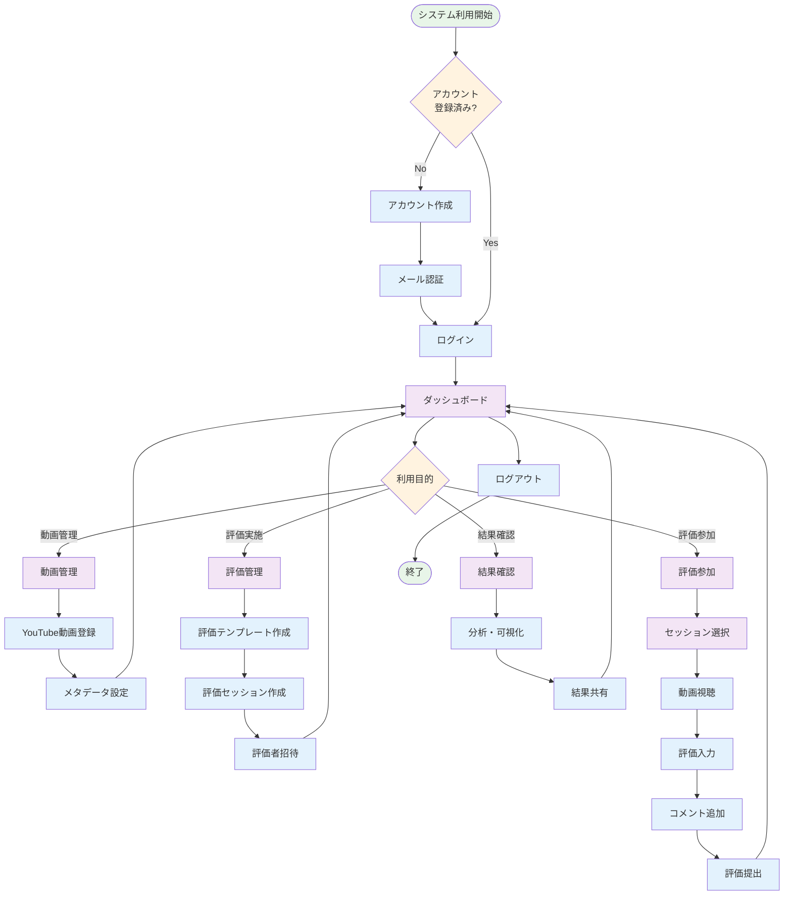
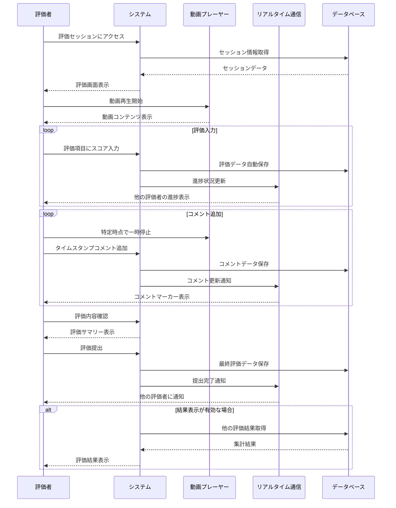

# ユーザーマニュアル

## 目次

1. [はじめに](#はじめに)
2. [アカウント作成・ログイン](#アカウント作成ログイン)
3. [動画の登録・管理](#動画の登録管理)
4. [評価テンプレートの作成](#評価テンプレートの作成)
5. [評価セッションの実施](#評価セッションの実施)
6. [評価の実行](#評価の実行)
7. [結果の確認・分析](#結果の確認分析)
8. [共有・フィードバック](#共有フィードバック)
9. [モバイル利用](#モバイル利用)
10. [トラブルシューティング](#トラブルシューティング)

## はじめに

よさこいパフォーマンス評価システムは、YouTube上のよさこいソーラン演舞動画を複数の評価者で評価し、その結果を分析・共有するためのWebアプリケーションです。

### システム利用フロー

*図1: システム利用の基本フロー*

### 主な機能

- YouTube動画の統合・管理
- カスタマイズ可能な評価基準
- 多人数による同時評価
- タイムライン連動コメント
- 詳細な分析・可視化
- 結果の共有・フィードバック

### 対応ブラウザー

- Chrome 90以上
- Firefox 88以上
- Safari 14以上
- Edge 90以上

## アカウント作成・ログイン

### 新規アカウント作成

1. **登録ページにアクセス**

   - ブラウザーで `https://your-domain.com/register` にアクセス
   - またはログインページの「アカウントをお持ちでない方はこちら」リンクをクリック

   
   
   *図3: ログイン画面の例*

2. **必要情報の入力**

   - **ユーザー名**: 半角英数字、3-20 文字（必須）
   - **メールアドレス**: 有効なメールアドレス（必須）
   - **パスワード**: 8 文字以上、大文字・小文字・数字・特殊文字を含む（必須）
   - **パスワード確認**: 上記と同じパスワードを再入力（必須）

3. **アカウント作成**

   - 「アカウント作成」ボタンをクリック
   - 入力エラーがある場合は、該当フィールドに赤色でエラーメッセージが表示されます

4. **メール認証**
   - 登録したメールアドレスに認証メールが送信されます
   - メール内のリンクをクリックして認証を完了
   - 認証完了後、自動的にダッシュボードにリダイレクトされます

### ログイン

1. **ログインページにアクセス**

   - ブラウザで `https://your-domain.com/login` にアクセス
   - または未認証状態で他のページにアクセスすると自動的にリダイレクトされます

2. **認証情報の入力**

   - **メールアドレス**: 登録済みのメールアドレスを入力
   - **パスワード**: アカウントのパスワードを入力
   - 「ログイン」ボタンをクリック

3. **ログイン成功**
   - 認証に成功すると、ダッシュボード（`/dashboard`）にリダイレクトされます
   - ナビゲーションバーにユーザー名とメニューが表示されます

   
   
   *図4: ダッシュボード画面の例*

### パスワードリセット

1. **パスワードリセット申請**

   - ログインページの「パスワードをお忘れですか？」リンクをクリック
   - パスワードリセットページ（`/password-reset`）に移動
   - メールアドレスを入力して「リセットメールを送信」ボタンをクリック

2. **新しいパスワードの設定**
   - メールに送信されたリンクをクリック
   - 新しいパスワードを入力（8 文字以上、大文字・小文字・数字・特殊文字を含む）
   - パスワード確認欄に同じパスワードを再入力
   - 「パスワードを更新」ボタンをクリック

## 動画の登録・管理

### YouTube 動画の登録

1. **動画管理ページにアクセス**

   - ナビゲーションバーの「動画」メニューをクリック
   - 動画管理ページ（`/videos`）に移動

2. **新規動画登録**

   - 「新しい動画を追加」ボタン（+アイコン）をクリック
   - 動画登録ダイアログが表示されます

3. **YouTube URL の入力**

   - **YouTube URL**フィールドに YouTube 動画の URL を貼り付け
   - 対応形式: `https://www.youtube.com/watch?v=VIDEO_ID` または `https://youtu.be/VIDEO_ID`
   - 「動画情報を取得」ボタンをクリック

4. **動画情報の自動取得**

   - YouTube から動画のタイトル、チャンネル名、サムネイルが自動取得されます
   - 取得に失敗した場合は、エラーメッセージが表示されます

5. **メタデータの入力**

   - **チーム名**: 演舞を行ったチーム名（必須）
   - **演舞名**: 演舞の名称（任意）
   - **大会名**: 開催された大会名（任意）
   - **年度**: 開催年（ドロップダウンから選択）
   - **開催地**: 大会の開催地（任意）
   - **タグ**: 検索用のキーワード（カンマまたはスペース区切り）

6. **登録完了**
   - 「動画を登録」ボタンをクリック
   - 登録が成功すると、動画一覧に新しい動画が表示されます
   - 登録に失敗した場合は、エラーメッセージが表示されます

### 動画一覧の確認

1. **動画一覧ページ**

   - ナビゲーションバーの「動画」メニューをクリック
   - 動画管理ページ（`/videos`）に移動

2. **動画一覧の表示**

   - 登録済みの動画がカード形式で表示されます
   - 各カードには以下の情報が表示されます：
     - YouTube サムネイル
     - 動画タイトル
     - チーム名
     - 登録日
     - タグ（ある場合）

   
   
   *図5: 動画管理画面の例*

3. **検索・フィルタリング**

   - **検索バー**: ページ上部の検索フィールドでキーワード検索
     - 動画タイトル、チーム名、演舞名、大会名で検索可能
   - **フィルターボタン**: 検索バー横のフィルターアイコンをクリック
     - **年度フィルター**: ドロップダウンから特定の年度を選択
     - **タグフィルター**: 特定のタグで絞り込み
   - **ソート**: ソートドロップダウンから並び替え方法を選択
     - 登録日（新しい順/古い順）
     - タイトル（あいうえお順/逆順）
     - チーム名（あいうえお順/逆順）

4. **動画の操作**

   - **詳細表示**: 動画カードをクリックして詳細ページ（`/videos/:id`）に移動
   - **編集**: 動画カードの編集アイコン（鉛筆マーク）をクリック
   - **削除**: 動画カードの削除アイコン（ゴミ箱マーク）をクリック
     - 確認ダイアログが表示されるので、「削除」ボタンで確定

5. **ページネーション**
   - 動画が多数ある場合、ページ下部にページネーションが表示されます
   - 1 ページあたり 12 件の動画が表示されます

### 動画情報の編集

1. **編集ダイアログの表示**

   - 動画一覧から編集したい動画の編集アイコン（鉛筆マーク）をクリック
   - 動画編集ダイアログが表示されます

2. **情報の更新**

   - **チーム名**: 演舞を行ったチーム名を修正
   - **演舞名**: 演舞の名称を修正
   - **大会名**: 開催された大会名を修正
   - **年度**: ドロップダウンから正しい年度を選択
   - **開催地**: 大会の開催地を修正
   - **タグ**: 検索用のキーワードを追加・削除

3. **変更の保存**

   - 「更新」ボタンをクリックして変更を保存
   - 「キャンセル」ボタンで変更を破棄
   - 更新が成功すると、動画一覧に反映されます

4. **注意事項**
   - YouTube URL は変更できません
   - 動画タイトルは YouTube から自動取得されるため変更できません
   - 必須項目（チーム名）が空の場合は保存できません

## 評価テンプレートの作成

### 新しいテンプレートの作成

1. **テンプレート作成ページにアクセス**

   - ナビゲーションバーの「テンプレート」メニューをクリック
   - テンプレート一覧ページ（`/templates`）に移動
   - 「新しいテンプレートを作成」ボタンをクリック
   - テンプレート作成ページ（`/templates/create`）に移動

2. **基本情報の入力**

   - **テンプレート名**: わかりやすい名前を設定（必須）
   - **説明**: テンプレートの用途や特徴を記述（任意）
   - **公開設定**: 他のユーザーと共有するかを選択

3. **カテゴリの追加**

   - 「カテゴリを追加」ボタン（+アイコン）をクリック
   - カテゴリ設定ダイアログが表示されます：
     - **カテゴリ名**: 例）技術面、表現力、構成（必須）
     - **説明**: カテゴリの評価内容（任意）
     - **重み**: 全体評価に占める割合（0.1-1.0、デフォルト 1.0）
   - 「カテゴリを追加」ボタンで確定

4. **評価項目の追加**

   - 作成したカテゴリ内の「評価項目を追加」ボタンをクリック
   - 評価項目設定ダイアログが表示されます：
     - **項目名**: 具体的な評価項目名（必須）
     - **説明**: 評価の観点や基準（任意）
     - **評価方式**: ドロップダウンから選択
       - 数値評価（1-10 点スケール）
       - 5 段階評価（1-5 点スケール）
       - 3 段階評価（1-3 点スケール）
       - はい/いいえ評価（0-1 点）
     - **重み**: カテゴリ内での重要度（0.1-1.0、デフォルト 1.0）
   - 「評価項目を追加」ボタンで確定

5. **テンプレートの保存**
   - すべての設定が完了したら「テンプレートを作成」ボタンをクリック
   - 作成が成功すると、テンプレート詳細ページにリダイレクトされます

### テンプレートの管理

1. **テンプレート一覧の確認**

   - ナビゲーションバーの「テンプレート」メニューをクリック
   - テンプレート一覧ページ（`/templates`）で以下の情報を確認：
     - テンプレート名
     - 作成者
     - 作成日・最終更新日
     - 使用回数（評価セッションでの利用数）
     - 公開/非公開ステータス

2. **テンプレートの操作**

   - **詳細表示**: テンプレートカードをクリックして詳細ページ（`/templates/:id`）に移動
   - **編集**: 編集アイコン（鉛筆マーク）をクリック（自分が作成したテンプレートのみ）
   - **複製**: 複製アイコンをクリックして既存テンプレートをベースに新規作成
   - **削除**: 削除アイコン（ゴミ箱マーク）をクリック（自分が作成したテンプレートのみ）

3. **テンプレートの共有**

   - **公開設定**: テンプレート編集時に「公開」チェックボックスをオンにする
   - **共有リンク**: 公開テンプレートは他のユーザーも利用可能
   - **エクスポート**: テンプレート詳細ページの「エクスポート」ボタンで JSON 形式でダウンロード
   - **インポート**: テンプレート一覧ページの「インポート」ボタンで JSON ファイルから読み込み

4. **フィルタリング・検索**
   - **検索バー**: テンプレート名や説明で検索
   - **フィルター**:
     - 自分が作成したテンプレートのみ表示
     - 公開テンプレートのみ表示
     - 使用回数でソート

## 評価セッションの実施

### 評価セッションの作成

1. **セッション作成ページにアクセス**

   - ナビゲーションバーの「セッション」メニューをクリック
   - セッション一覧ページ（`/sessions`）に移動
   - 「新しいセッションを作成」ボタンをクリック

2. **基本設定**

   - **セッション名**: わかりやすい名前を設定（必須）
   - **説明**: セッションの目的や注意事項を記述（任意）
   - **評価対象動画**: ドロップダウンから登録済み動画を選択（必須）
     - 動画のサムネイルとタイトルが表示されます
   - **評価テンプレート**: ドロップダウンから使用するテンプレートを選択（必須）
     - 自分が作成したテンプレートと公開テンプレートが表示されます

3. **期間設定**

   - **開始日時**: 評価開始日時をカレンダーから選択（必須）
   - **終了日時**: 評価締切日時をカレンダーから選択（必須）
   - **タイムゾーン**: 自動的に日本標準時（JST）が設定されます
   - 注意: 終了日時は開始日時より後である必要があります

4. **詳細設定**

   - **匿名評価**: チェックボックスをオンにすると評価者名が非表示になります
   - **結果表示**: チェックボックスをオンにすると提出後に他の評価結果が表示されます
   - **コメント許可**: チェックボックスをオンにするとタイムラインコメント機能が有効になります
   - **自動リマインダー**: チェックボックスをオンにすると締切前に自動でリマインダーメールが送信されます

5. **セッションの作成**
   - 「セッションを作成」ボタンをクリック
   - 作成が成功すると、セッション詳細ページにリダイレクトされます

### 評価者の招待

1. **招待機能へのアクセス**

   - セッション詳細ページ（`/sessions/:id`）で「評価者を招待」ボタンをクリック
   - 招待ダイアログが表示されます

2. **招待方法の選択**

   - **メール招待**:
     - メールアドレス入力フィールドに評価者のメールアドレスを入力
     - 複数のメールアドレスを改行またはカンマ区切りで入力可能
     - 「招待メールを送信」ボタンをクリック
   - **リンク共有**:
     - 「招待リンクを生成」ボタンをクリック
     - 生成されたリンクをコピーして評価者に直接共有
     - リンクの有効期限を設定可能

3. **招待メッセージのカスタマイズ**

   - **件名**: メール招待の件名を編集可能
   - **メッセージ本文**: 評価者向けのメッセージを作成
     - 評価の観点や注意事項を記載
     - セッションの背景や目的を説明
     - 締切日時の強調

4. **権限設定**

   - **評価者**: 評価の実行と結果閲覧が可能
   - **オブザーバー**: 結果閲覧のみ可能（評価は実行不可）
   - 招待時にロールを選択

5. **招待状況の確認**
   - セッション詳細ページの「参加者」タブで招待状況を確認
   - 招待済み、参加済み、評価完了のステータスが表示されます
   - 必要に応じてリマインダーメールを再送信可能

### セッションの管理

1. **進捗確認**

   - 招待した評価者の参加状況
   - 評価完了状況の確認

2. **リマインダー送信**

   - 未完了の評価者にリマインダーメール送信

3. **期限延長**
   - 必要に応じて評価期限を延長

## 評価の実行

### 評価プロセスフロー

*図2: 評価実行のシーケンス図*

### 評価画面の操作

1. **評価ページにアクセス**

   - 招待メールのリンクをクリック
   - またはセッション一覧（`/sessions`）から対象セッションを選択
   - 評価ページ（`/sessions/:sessionId/evaluate`）に移動

2. **評価画面の構成**

   - **左側**: YouTube 動画プレーヤー
   - **右側**: 評価フォーム（モバイルでは下部に表示）
   - **上部**: セッション情報（名前、締切日時、進捗状況）

   
   
   *図6: 評価画面の例*

3. **動画の再生**

   - **YouTube Player**: 埋め込まれた YouTube プレーヤーで動画を再生
   - **再生コントロール**:
     - 再生/一時停止ボタン
     - シークバーでの位置移動
     - 音量調整
   - **再生速度調整**: プレーヤー設定から選択（0.25x, 0.5x, 0.75x, 1x, 1.25x, 1.5x, 2x）
   - **全画面表示**: プレーヤーの全画面ボタンをクリック
   - **画質調整**: プレーヤー設定から画質を選択

4. **評価の入力**
   - **カテゴリタブ**: 評価テンプレートのカテゴリごとにタブが表示
   - **評価項目**: 各項目にスライダーまたは選択ボタンで点数を入力
   - **コメント欄**: 各項目に任意でコメントを追加可能
   - **自動保存**: 入力内容は自動的に保存されます（保存アイコンが表示）
   - **進捗表示**: 評価完了率がプログレスバーで表示

### タイムライン連動コメント

1. **コメント機能の有効化**

   - セッション作成時に「コメント許可」が有効になっている場合のみ利用可能
   - 動画プレーヤー下部にタイムラインコメント欄が表示されます

2. **コメントの追加**

   - 動画再生中に「コメント追加」ボタン（+アイコン）をクリック
   - コメント入力ダイアログが表示されます：
     - **タイムスタンプ**: 現在の再生時点が自動設定（手動調整可能）
     - **コメント内容**: テキストエリアにコメントを入力
     - **カテゴリ**: コメントの種類を選択（技術面、表現力、構成など）
   - 「コメントを追加」ボタンで確定

3. **コメントの表示**

   - **タイムライン表示**: 動画プレーヤー下のタイムライン上にマーカーで表示
   - **マーカーの色**: カテゴリごとに異なる色で表示
   - **ホバー表示**: マーカーにマウスを合わせるとコメント内容がプレビュー表示
   - **クリック機能**: マーカーをクリックすると該当時点に動画がジャンプ

4. **コメントの管理**

   - **編集**: 自分が追加したコメントは編集アイコンで編集可能
   - **削除**: 自分が追加したコメントは削除アイコンで削除可能
   - **他者のコメント**: 他の評価者のコメントは閲覧のみ（編集・削除不可）
   - **コメント一覧**: 画面右側のコメント一覧で全コメントを時系列表示

5. **コメントの共有**
   - 匿名評価が無効の場合、コメント作成者名が表示されます
   - 匿名評価が有効の場合、「評価者 A」などの匿名表示になります

### 評価の提出

1. **提出前の確認**

   - **完了チェック**: 画面上部の進捗バーで評価完了率を確認
   - **必須項目**: 未入力の必須項目がある場合、該当項目が赤色でハイライト表示
   - **警告表示**: 未完了項目がある場合、「未完了の項目があります」という警告メッセージが表示

2. **評価内容の確認**

   - 「評価内容を確認」ボタンをクリック
   - 確認ダイアログが表示され、以下の内容を確認できます：
     - 各カテゴリの評価点数
     - 総合評価点数
     - 追加したコメント一覧
     - タイムラインコメント一覧

3. **最終確認と提出**

   - 確認ダイアログで「評価を提出」ボタンをクリック
   - 最終確認ダイアログが表示：
     - 「提出後は評価内容の修正ができません」という注意事項
     - 「本当に提出しますか？」という確認メッセージ
   - 「提出する」ボタンで最終確定

4. **提出完了**

   - 提出が成功すると、提出完了画面が表示されます
   - 以下の情報が表示されます：
     - 提出日時
     - 総合評価点数
     - 「評価ありがとうございました」というメッセージ
   - 提出完了メールが登録メールアドレスに自動送信されます

5. **提出後の操作**
   - **結果閲覧**: セッション設定で「結果表示」が有効な場合、他の評価者の結果を閲覧可能
   - **セッション一覧**: 「セッション一覧に戻る」ボタンでセッション一覧ページに移動
   - **再評価不可**: 一度提出した評価は修正できません

## 結果の確認・分析

### 評価結果の概要

1. **結果ダッシュボード**

   - セッション完了後に結果ダッシュボードが表示
   - 全体的な評価傾向を確認

2. **基本統計**
   - **平均点**: 全評価者の平均スコア
   - **最高点・最低点**: 各項目の最高・最低評価
   - **標準偏差**: 評価のばらつき度合い
   - **完了率**: 評価完了者の割合

### 詳細分析

1. **カテゴリ別分析**

   - レーダーチャートでカテゴリ別スコアを表示
   - 強み・弱みの可視化

2. **評価者比較**

   - 評価者ごとのスコア比較
   - 評価傾向の違いを分析

3. **項目別分析**

   - 各評価項目の詳細分析
   - スコア分布のヒストグラム表示

4. **一致度分析**
   - 評価者間の評価一致度
   - 意見が分かれた項目の特定

### タイムライン分析

1. **コメント分析**

   - 時系列でのコメント分布
   - 注目された場面の特定

2. **評価ポイント**
   - 高評価・低評価を受けた時点の分析
   - 改善点の具体的な特定

## 共有・フィードバック

### 結果の共有

1. **共有設定**

   - 共有範囲の設定（全体公開、特定ユーザー、パスワード保護）
   - 共有期限の設定

2. **共有方法**

   - **リンク共有**: 共有用 URL の生成
   - **メール共有**: 指定したメールアドレスに送信
   - **埋め込み**: 他の Web サイトに埋め込み

3. **共有内容の選択**
   - 表示する分析結果の選択
   - 個人情報の匿名化設定

### フィードバック機能

1. **コメント・ディスカッション**

   - 共有された結果にコメントを追加
   - スレッド形式でのディスカッション

2. **改善提案**

   - 具体的な改善提案の投稿
   - 提案への投票・評価機能

3. **通知機能**
   - 新しいコメントの通知
   - メンション機能

## 新機能ガイド

### リアルタイム評価更新機能

#### 概要

評価セッション中に、他の評価者の進捗状況をリアルタイムで確認できる機能です。WebSocket技術により、評価の進行状況が即座に反映されます。

#### 利用方法

1. **進捗状況の確認**
   - 評価ページの上部に参加者一覧が表示されます
   - 各参加者の評価完了率がプログレスバーで表示されます
   - オンライン状態（緑色）・オフライン状態（グレー）が表示されます

2. **リアルタイム通知**
   - 他の評価者が評価を完了すると、通知が表示されます
   - 新しいコメントが追加されると、リアルタイムで表示されます
   - セッション主催者が設定を変更すると、即座に反映されます

3. **同期機能**
   - ネットワーク接続が復旧すると、自動的に最新状態に同期されます
   - 評価データの競合が発生した場合、適切に解決されます

### 高度なタイムライン連動コメント

#### 機能拡張

従来のタイムラインコメント機能に加えて、以下の機能が追加されました：

1. **カテゴリ別コメント**
   - コメントを評価カテゴリ（技術面、表現力、構成など）で分類
   - カテゴリごとに異なる色でマーカー表示
   - カテゴリフィルターでコメントを絞り込み表示

2. **コメント検索機能**
   - コメント内容でのキーワード検索
   - 特定の時間範囲でのコメント検索
   - 評価者別でのコメント検索

3. **コメント統計**
   - 時間帯別のコメント密度表示
   - 最も注目された時間帯の特定
   - カテゴリ別コメント分布の可視化

#### 使用方法

1. 動画再生中に注目したい場面で一時停止
2. 「コメント追加」ボタンをクリック
3. カテゴリを選択（技術面、表現力、構成、その他）
4. コメント内容を入力
5. 「追加」ボタンでコメントを保存

### 通知システム

#### 通知の種類

1. **評価セッション関連**
   - 新しいセッションへの招待
   - セッション開始・終了の通知
   - 評価締切のリマインダー
   - 他の評価者の評価完了通知

2. **コメント・ディスカッション関連**
   - 新しいコメントの追加通知
   - 自分のコメントへの返信通知
   - ディスカッションスレッドの更新通知

3. **システム関連**
   - 新機能のお知らせ
   - メンテナンス予定の通知
   - セキュリティアップデートの通知

#### 通知設定

1. **通知設定ページへのアクセス**
   - ユーザーメニューから「設定」→「通知設定」を選択
   - プロフィールページ（`/profile`）の「通知設定」タブをクリック

2. **通知方法の選択**
   - **ブラウザ通知**: ブラウザのプッシュ通知機能を使用
   - **メール通知**: 登録メールアドレスに通知メールを送信
   - **アプリ内通知**: システム内の通知センターに表示

3. **通知タイプ別設定**
   - 各通知タイプごとに有効/無効を設定可能
   - 通知頻度の調整（即座、1時間ごと、1日ごと）
   - 重要度による通知フィルタリング

#### 通知の確認方法

1. **通知センター**
   - ナビゲーションバーの通知アイコン（ベルマーク）をクリック
   - 未読通知数がバッジで表示されます
   - 通知一覧で詳細を確認できます

2. **通知の操作**
   - **既読にする**: 通知をクリックすると既読状態になります
   - **削除**: 不要な通知は削除ボタンで削除できます
   - **一括操作**: 「すべて既読にする」「すべて削除」が可能

### オフライン機能（PWA対応）

#### Progressive Web App（PWA）機能

YOSAKOIパフォーマンス評価システムは、PWA技術により、オフライン環境でも一部機能を利用できます。

#### オフライン対応機能

1. **評価結果の閲覧**
   - 一度表示した評価結果はオフラインでも閲覧可能
   - グラフやチャートもオフラインで表示されます
   - 過去の評価履歴の確認が可能

2. **評価の下書き保存**
   - オフライン時に入力した評価は下書きとして保存
   - ネットワーク復旧時に自動的にサーバーに同期
   - 複数デバイス間での下書き同期

3. **動画情報の表示**
   - キャッシュされた動画メタデータの表示
   - サムネイル画像の表示
   - 動画一覧の閲覧（キャッシュ済みのもの）

#### オフライン状態の確認

1. **オフライン表示**
   - 画面下部にオフライン状態のバナーが表示されます
   - 「オフライン」アイコンがナビゲーションバーに表示されます

2. **同期状況の確認**
   - 未同期のデータがある場合、同期アイコンが表示されます
   - ネットワーク復旧時に自動同期が開始されます
   - 同期完了時に確認メッセージが表示されます

#### PWAインストール

1. **ブラウザからのインストール**
   - Chrome: アドレスバーの「インストール」ボタンをクリック
   - Safari: 共有メニューから「ホーム画面に追加」を選択
   - Edge: アドレスバーの「アプリをインストール」をクリック

2. **インストール後の利用**
   - デスクトップやホーム画面からアプリとして起動
   - ブラウザのアドレスバーやタブが非表示になり、アプリライクな体験
   - オフライン時でも起動可能

### データ共有・エクスポート機能

#### 評価結果の共有

1. **共有リンクの生成**
   - 評価結果ページで「共有」ボタンをクリック
   - 共有設定ダイアログが表示されます：
     - **公開範囲**: 全体公開、特定ユーザー、パスワード保護
     - **有効期限**: 1日、1週間、1ヶ月、無期限
     - **表示内容**: 詳細結果、サマリーのみ、匿名化

2. **埋め込み機能**
   - 他のWebサイトやブログに結果を埋め込み可能
   - 埋め込み用HTMLコードを自動生成
   - レスポンシブ対応で様々なサイズに対応

#### データエクスポート

1. **対応形式**
   - **CSV**: 表計算ソフトでの分析用
   - **JSON**: プログラムでの処理用
   - **PDF**: 印刷・配布用レポート
   - **Excel**: 詳細分析用（.xlsx形式）

2. **エクスポート内容の選択**
   - 評価スコア一覧
   - コメント一覧
   - 統計情報
   - グラフ・チャート

3. **一括エクスポート**
   - 複数セッションの結果を一括エクスポート
   - 期間指定でのデータ抽出
   - チーム別、大会別でのデータ絞り込み

## モバイル利用

### モバイル対応機能

1. **レスポンシブデザイン**
   - スマートフォン・タブレットに最適化
   - タッチ操作に対応
   - Material-UIによる統一されたデザイン

2. **タッチ最適化**
   - 最小タッチターゲットサイズ（44px以上）
   - スワイプジェスチャー対応
   - ピンチズーム対応（グラフ・チャート）

3. **モバイル専用機能**
   - 音声入力によるコメント入力
   - カメラ機能との連携（将来実装予定）
   - GPS位置情報の活用（大会会場での利用）

4. **PWA機能**
   - ホーム画面へのアプリ追加
   - オフライン時の基本機能利用
   - プッシュ通知対応

### モバイル利用時の注意点

1. **動画再生**

   - モバイル環境での動画品質調整
   - データ使用量の注意

2. **入力方法**
   - 音声入力対応
   - 予測変換機能

## トラブルシューティング

### よくある問題と解決方法

#### ログインできない

**症状**: メールアドレスとパスワードを入力してもログインできない

**解決方法**:

1. パスワードの大文字・小文字を確認
2. ブラウザのキャッシュをクリア
3. パスワードリセット機能を利用
4. アカウントがロックされていないか確認

#### 動画が再生されない

**症状**: YouTube 動画が表示されない、または再生できない

**解決方法**:

1. インターネット接続を確認
2. ブラウザを最新版に更新
3. 広告ブロッカーを無効化
4. 動画が削除・非公開になっていないか確認

#### 評価が保存されない

**症状**: 入力した評価が保存されない

**解決方法**:

1. インターネット接続を確認
2. ブラウザを再読み込み
3. 別のブラウザで試行
4. JavaScript が有効になっているか確認

#### 招待メールが届かない

**症状**: 評価セッションの招待メールが届かない

**解決方法**:

1. **迷惑メールフォルダを確認**
   - Gmail: 「迷惑メール」フォルダを確認
   - Outlook: 「迷惑メール」フォルダを確認
   - Yahoo Mail: 「迷惑メール」フォルダを確認

2. **メールアドレスの入力ミスを確認**
   - セッション主催者に正しいメールアドレスを再確認
   - 大文字・小文字、ピリオド、ハイフンなどの確認

3. **ドメインを受信許可設定**
   - `@your-domain.com` を受信許可リストに追加
   - メールフィルターの設定を確認

4. **ネットワーク環境の確認**
   - 企業ファイアウォールによるブロックの可能性
   - VPN接続時の制限の確認

5. **代替手段の利用**
   - 招待リンクの直接共有を依頼
   - 別のメールアドレスでの招待を依頼

#### 動画が正常に表示されない

**症状**: YouTube動画が読み込まれない、または再生できない

**解決方法**:

1. **ブラウザの確認**
   - ブラウザを最新版に更新
   - 別のブラウザで試行（Chrome、Firefox、Safari、Edge）
   - シークレット/プライベートモードで試行

2. **拡張機能の確認**
   - 広告ブロッカーを一時的に無効化
   - セキュリティ拡張機能の設定確認
   - すべての拡張機能を無効化して試行

3. **ネットワーク環境の確認**
   - インターネット接続の安定性確認
   - 企業ネットワークでのYouTube制限確認
   - VPN使用時の接続確認

4. **動画の状態確認**
   - YouTube上で動画が削除されていないか確認
   - 動画が非公開設定になっていないか確認
   - 地域制限がかかっていないか確認

5. **キャッシュとCookieのクリア**
   - ブラウザのキャッシュをクリア
   - Cookieを削除
   - ローカルストレージをクリア

#### 評価データが保存されない

**症状**: 入力した評価が保存されない、または消失する

**解決方法**:

1. **接続状態の確認**
   - インターネット接続の安定性確認
   - オフライン状態の表示確認
   - ページの再読み込み

2. **ブラウザ設定の確認**
   - JavaScriptが有効になっているか確認
   - Cookieが有効になっているか確認
   - ローカルストレージが有効になっているか確認

3. **セッション状態の確認**
   - ログイン状態の確認
   - セッションの有効期限確認
   - 再ログインの実行

4. **入力データの確認**
   - 必須項目がすべて入力されているか確認
   - 文字数制限を超えていないか確認
   - 特殊文字の使用確認

5. **一時的な対処法**
   - 評価内容をテキストファイルにバックアップ
   - 別のデバイスで試行
   - 管理者に状況を報告

#### リアルタイム機能が動作しない

**症状**: 他の評価者の進捗が表示されない、コメントが同期されない

**解決方法**:

1. **WebSocket接続の確認**
   - ブラウザの開発者ツールでWebSocket接続を確認
   - ファイアウォールによるWebSocket通信のブロック確認
   - プロキシサーバーの設定確認

2. **ブラウザの対応確認**
   - WebSocketをサポートするブラウザの使用
   - ブラウザのバージョン確認
   - 別のブラウザでの動作確認

3. **ネットワーク環境の確認**
   - 企業ネットワークでのWebSocket制限
   - VPN使用時の制限
   - モバイルネットワークでの制限

4. **一時的な対処法**
   - ページの手動更新で最新状態を確認
   - 定期的なページリロード
   - オフライン機能の活用

#### 通知が表示されない

**症状**: ブラウザ通知やアプリ内通知が表示されない

**解決方法**:

1. **ブラウザ通知の許可**
   - ブラウザの通知許可設定を確認
   - サイト固有の通知設定を確認
   - システムの通知設定を確認

2. **通知設定の確認**
   - ユーザー設定で通知が有効になっているか確認
   - 通知タイプ別の設定確認
   - 通知頻度の設定確認

3. **デバイス設定の確認**
   - デスクトップ通知の設定確認
   - モバイルデバイスの通知設定確認
   - 集中モード/おやすみモードの確認

4. **代替手段の利用**
   - メール通知の有効化
   - 定期的な手動確認
   - 通知センターの定期チェック

### エラーメッセージ一覧

#### 認証エラー

- **「認証に失敗しました」**: ログイン情報を確認してください
- **「セッションが期限切れです」**: 再度ログインしてください
- **「アクセス権限がありません」**: 管理者に権限を確認してください

#### 入力エラー

- **「必須項目が入力されていません」**: 赤色で表示された項目を入力してください
- **「無効な形式です」**: 入力形式を確認してください
- **「文字数制限を超えています」**: 文字数を減らしてください

#### システムエラー

- **「サーバーエラーが発生しました」**: しばらく時間をおいて再試行してください
- **「ネットワークエラー」**: インターネット接続を確認してください

### サポート連絡先

**技術的な問題**:

- メール: <support@yosakoi-eval.com>
- 電話: 03-XXXX-XXXX（平日 9:00-18:00）

**利用方法に関する質問**:

- FAQ: <https://help.yosakoi-eval.com>
- ユーザーフォーラム: <https://forum.yosakoi-eval.com>

**緊急時**:

- 緊急サポート: <emergency@yosakoi-eval.com>
- 24 時間対応（重大な障害のみ）

### システム要件

**推奨環境**:

- OS: Windows 10 以上、macOS 10.15 以上、iOS 13 以上、Android 8 以上
- ブラウザ: Chrome 90 以上、Firefox 88 以上、Safari 14 以上
- インターネット: 安定した接続（推奨 5Mbps 以上）
- 画面解像度: 1024×768 以上

**必要な権限**:

- JavaScript: 有効
- Cookie: 有効
- ローカルストレージ: 有効（オフライン機能使用時）
